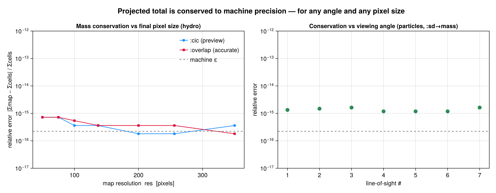

# Off-axis Conservation Proof

A projection only changes the **viewing geometry** of the data — it must not change the
physical content. For an *extensive* quantity (one whose pixel values sum to a physical
total, e.g. mass) the sum over the projected map must equal the geometry-independent ground
truth

```math
\sum_{\text{pixels}} M_{ij} \;=\; \sum_{\text{cells}} m_\text{cell}
```

**for every viewing angle and for every output pixel size.** This page states why that holds
for Mera's off-axis projection and shows the measured errors.

!!! note "Necessary, not sufficient"
    Conservation is a *partition-of-unity* identity, so **all four binning modes** (`:cic`,
    `:ngp`, `:overlap`, `:exact`) satisfy it equally, to ~10⁻¹⁶. It therefore says nothing about which
    method is more *accurate* — i.e. about **where** the mass lands. The spatial fidelity (and
    how `:overlap` differs from the centre-deposit previews) is a separate question, shown in the
    "How the methods differ" section of the [off-axis projection tutorial](06_offaxis_Projection.md)
    and verified in `test/35_offaxis_accuracy_tests.jl`.

## Why it is conserved

Every binning mode (`:cic`, `:ngp`, `:overlap`, `:exact`) is a **partition-of-unity** deposit.
The centre-deposit modes draw from the standard particle-mesh assignment schemes (Hockney &
Eastwood, *Computer Simulation Using Particles*, 1988); the footprint modes (`:overlap`,
`:exact`) renormalise each cell's per-pixel shares to sum to 1:

* each cell (or particle) distributes its full weight across the pixels of the camera plane,
  with deposit fractions that **sum to exactly 1**;
* therefore the total deposited weight is `Σ_cells m_cell` regardless of *where* the cells land;
* rotating the camera (`los`, `theta/phi`, `:faceon`, `:edgeon`) or changing the pixel grid
  (`res`, `pxsize`) only moves cells between pixels — it never creates or destroys weight.

Cells whose deposit stencil reaches past the map border fold the outside fraction back onto the
edge pixel (as the axis-aligned binner also does), so the global sum is preserved to machine
precision rather than leaking at the boundary.

For the accurate `:overlap` mode the same argument holds per sub-point: a cell is split into
`n³` sub-points each carrying `weight/n³`, and the sub-point shares again sum to 1. For the
analytic `:exact` mode the cell's per-pixel footprint integrals are renormalised so they sum to
the cell volume (= 1 in fractional terms), so the conserved total is again exact by construction.
Both footprint modes (`:overlap` and `:exact`) are thread-parallel (cells split into contiguous
chunks accumulated into thread-local grids, then summed); the conserved total is independent of
the thread count.

## Measured invariance

The test suite proves this numerically on real RAMSES data in
[`test/34_offaxis_invariance_tests.jl`](https://github.com/ManuelBehrendt/Mera.jl/blob/master/test/34_offaxis_invariance_tests.jl).
It projects an extensive quantity over a grid of **7 line-of-sight angles × 5 final-map pixel
sizes (including non-power-of-two) × {`:cic`, `:overlap`, `:exact`}** and compares the map sum
to the ground-truth `sum(getvar(obj, q))`.

| Quantity (object) | angles × pixel sizes × binning | worst relative error |
|---|---|---|
| `:mass` (hydro)            | 7 × 7 × 3 | ~10⁻¹⁵ |
| `:volume` (hydro, `:sum`)  | 7 × 3     | 1.2 × 10⁻¹⁶ |
| `:sd → mass` (particles)   | 7 × 7 × 3 | 1.6 × 10⁻¹⁵ |

The errors are at the floating-point round-off level — i.e. the projected total is, for all
practical purposes, **independent of the viewing angle and of the chosen map resolution**.

The plot below shows the actual measured relative error from this sweep. **Left:** hydro mass
conservation versus the final-map pixel count, for both the fast `:cic` preview and the accurate
`:overlap` deposit — both curves hug the machine-ε line (dashed) across every resolution.
**Right:** particle surface-density → mass conservation across the seven viewing angles — every
point sits at ~10⁻¹⁵. Both panels are decades below any level that would matter physically.



```julia
# the sweep behind the plot (abbreviated)
using Mera
gas  = gethydro(getinfo(100, "spiral_clumps"))
Mtot = sum(getvar(gas, :mass, :Msol))
LOS  = [[0,0,1], [1,0,0], [0,1,0], [1,1,1], [1,-2,0.5], [-2,1,3], [0.3,0.4,0.866]]
for res in (50, 75, 100, 137, 200, 256, 350), binning in (:cic, :overlap, :exact)
    worst = maximum(abs(sum(projection(gas, :mass, :Msol, los=los, res=res, binning=binning,
                                       verbose=false, show_progress=false).maps[:mass]) - Mtot) / Mtot
                    for los in LOS)
    @assert worst < 1e-9
end
```

The same test suite also covers off-axis **RT** photon fields (the volume-weighted photon sum
is conserved across angles and pixel sizes) and the **gravity** interface.

## Correct placement, not just a correct total

Conservation alone would be satisfied by a buggy projection that put the right *amount* of
mass in the *wrong* pixels. So the suite additionally proves that mass is placed at the
correct **location**: the mass-weighted centroid of the projected map equals the analytically
rotated 3-D mass centroid `Σ(m·r)/Σm` (rotated by the camera basis) to **better than 1 % of a
pixel**, for every viewing angle. For intensive quantities, the mass-weighted spatial mean of
the map (e.g. ⟨vₓ⟩) reproduces the global mass-weighted mean of the cells to ~10⁻¹⁵ and is
identical for all angles. Together these show the off-axis transform is geometrically correct,
not merely flux-conserving.

## Reproduce it yourself

```julia
using Mera
info = getinfo(100, "spiral_clumps")
gas  = gethydro(info)

# geometry-independent ground truth
Mtot = sum(getvar(gas, :mass, :Msol))

# sweep angles and final-map pixel sizes; every total must equal Mtot
for los in ([0,0,1], [1,0,0], [1,1,1], [1,-2,0.5], [-2,1,3])
    for res in (50, 100, 137, 256)            # incl. non-power-of-two
        for binning in (:cic, :overlap, :exact)
            m = projection(gas, :mass, :Msol, los=los, res=res, binning=binning,
                           verbose=false, show_progress=false)
            relerr = abs(sum(m.maps[:mass]) - Mtot) / Mtot
            @assert relerr < 1e-9
        end
    end
end
println("Off-axis mass conservation verified across all angles and pixel sizes.")
```

## Relation to other tools

This combination is the distinguishing property of Mera's off-axis projection:

* like ray-cast off-axis projections (e.g. yt) the accurate `:overlap`/`:exact` modes are
  **footprint-correct** — coarse AMR cells cover the full area of their projected shadow;
* the `:exact` mode goes further: it integrates the line-of-sight column (chord length through
  each cube) over every pixel **analytically** — a box-spline footprint that no mainstream tool
  computes for off-axis AMR (most resample to a uniform grid or ray-cast);
* **unlike** a ray-cast integration, the deposit is **exactly mass-conserving** — the projected
  total matches the data total to machine precision, at any angle and any pixel size, as shown above.
