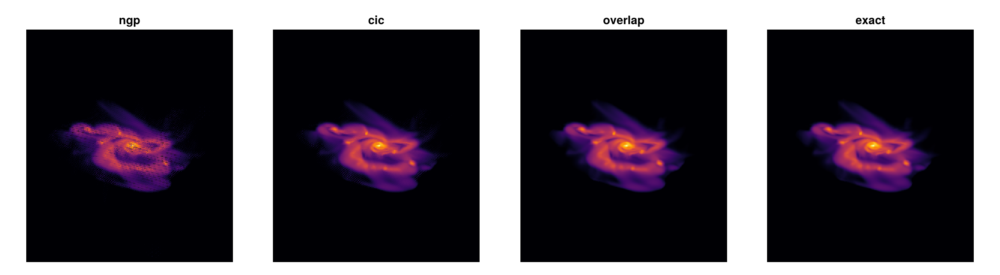
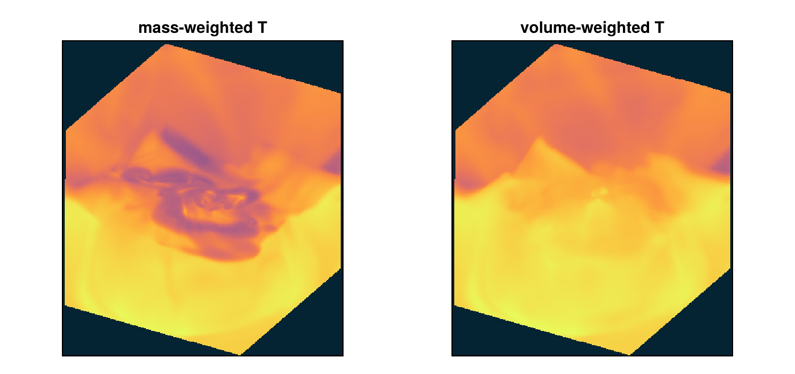
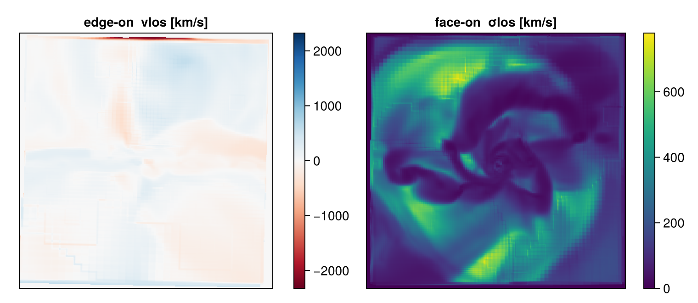
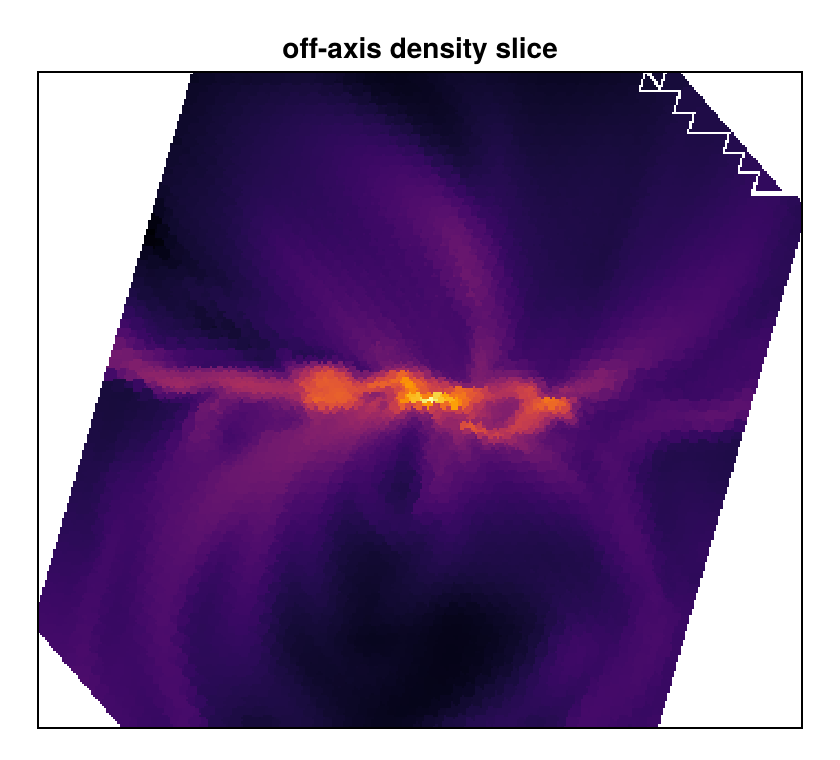

# Off-Axis Projection: How It Works Internally

!!! tip "Run it yourself"
    This page is also an executable **Jupyter notebook** — [open / download `offaxis_internals.ipynb`](https://github.com/ManuelBehrendt/Notebooks/blob/master/Mera-Docs/version_1/offaxis_internals.ipynb). The notebooks run end-to-end and double as part of Mera's test suite.


The [off-axis guide](06_offaxis_Projection.md) shows **how to use** arbitrary-viewing-angle
projections; the [conservation proof](offaxis_conservation_proof.md) demonstrates **that** they
conserve mass. This page explains **how the machinery works inside**, step by step, so you can
judge when to trust a map, which deposit kernel to choose, and what the camera metadata means.

The pipeline, in order:

1. resolve the **view specification** into a line-of-sight vector,
2. build an orthonormal **camera basis**,
3. **rotate cell centres** into the camera frame,
4. **clip in world space** (this is what guarantees mass conservation),
5. **auto-fit the frame** with AMR-aware padding,
6. **deposit** each cell onto the pixel grid (four kernels),
7. normalise (weighted sums vs weighted means).

Everything below runs on the small `spiral_clumps` fixture — a rotating galaxy disk, ideal
because face-on and edge-on views look qualitatively different.

```julia
using Mera, CairoMakie
CairoMakie.activate!()
println("threads = ", Threads.nthreads())
BASE = "/Volumes/FASTStorage/Simulations/Mera-Tests"   # <-- change me
info = getinfo(100, joinpath(BASE, "RAMSES/spiral_clumps"), verbose=false)
gas  = gethydro(info, verbose=false, show_progress=false);
println(length(gas.data), " cells, levels ", gas.lmin, "-", gas.lmax,
        ", boxlen = ", info.boxlen * info.scale.kpc, " kpc")
```

```
[ Info: Precompiling Mera [02f895e8-fdb1-4346-8fe6-c721699f5126] (cache misses: wrong source (2), dep missing source (4), mismatched flags (10))
SYSTEM: caught exception of type :MethodError while trying to print a failed Task notice; giving up
*__   __ _______ ______   _______
|  |_|  |       |    _ | |   _   |
SYSTEM: caught exception of type :MethodError while trying to print a failed Task notice; giving up
SYSTEM: caught exception of type :MethodError while trying to print a failed Task notice; giving up
|       |    ___|   | || |  |_|  |
SYSTEM: caught exception of type :MethodError while trying to print a failed Task notice; giving up
|       |   |___|   |_||_|       |
|       |    ___|    __  |       |
| ||_|| |   |___|   |  | |   _   |
|_|   |_|_______|___|  |_|__| |__|
Mera v1.8.0
[ Info: Precompiling CairoMakie [13f3f980-e62b-5c42-98c6-ff1f3baf88f0] (cache misses: wrong dep version loaded (4))
SYSTEM: caught exception of type :MethodError while trying to print a failed Task notice; giving up
[ Info: Precompiling PolynomialsMakieExt [6a4b1961-d857-5aa3-b7f6-fc7c46de29bb] (cache misses: wrong dep version loaded (2))
SYSTEM: caught exception of type :MethodError while trying to print a failed Task notice; giving up
[ Info: Precompiling MeraMakieExt [defab1b5-6ec5-5409-a2f4-69ec619b2a0e] (cache misses: wrong dep version loaded (2))
SYSTEM: caught exception of type :MethodError while trying to print a failed Task notice; giving up
[ Info: Mera v1.8.0
threads = 4
590311 cells, levels
3-7, boxlen = 100.00000000006482 kpc
```

## 1. From a view specification to a line of sight

`projection` accepts exactly **one** way of specifying the view per call (giving two raises an
error rather than silently picking one):

| Specifier | Meaning |
|---|---|
| `los=[lx,ly,lz]` | explicit viewing direction (need not be normalised) |
| `inclination=…, azimuth=…, axis=…` | tilt off a reference axis (`:z` default, `:x`/`:y`, a vector, or `:angmom`) and rotate about it |
| `theta=…, phi=…` | spherical angles: `los = [sinθcosφ, sinθsinφ, cosθ]` |
| `direction=:faceon` / `:edgeon` | shortcuts for `inclination=0°/90°` with `axis=:angmom` |

Angles are **degrees by default** (`angle_unit=:rad` to switch). `:angmom`, `:faceon` and
`:edgeon` fetch the gas angular momentum `L = Σ(l_x, l_y, l_z)` about `center` — so center on the
object, or `L` is contaminated by bulk motion.

## 2. The camera basis

The resolved line of sight feeds `build_camera_basis(los, up; roll)`, which returns three unit
vectors `(right, up, w)`: `w = los/‖los‖` points *into* the image, `right` and `up` span the image
plane, and the basis is right-handed (`right × up = w`). If no `up` hint is given (or it is
parallel to `los`), a **deterministic auto-up** is used: the world axis least parallel to `w`,
Gram–Schmidt-orthogonalised — the same view always yields the same image orientation. `roll`
rotates the image about the line of sight (the astronomical position angle).

```julia
using LinearAlgebra
right, up, w = Mera.build_camera_basis([1.0, 1.0, 1.0])
println("w     = ", round.(w, digits=4))
println("right = ", round.(right, digits=4))
println("up    = ", round.(up, digits=4))
println("orthonormal: ", all(isapprox.((norm(right), norm(up), norm(w)), 1.0; atol=1e-12)),
        ", right⋅up = ", round(dot(right, up), digits=15))
println("right-handed (right × up == w): ", cross(right, up) ≈ w)
# roll rotates the image plane but never the line of sight
r2, u2, w2 = Mera.build_camera_basis([1.0, 1.0, 1.0]; roll=deg2rad(30))
println("after 30° roll: w unchanged = ", w2 ≈ w, ", right rotated by ",
        round(rad2deg(acos(clamp(dot(right, r2), -1, 1))), digits=2), "°")
```

```
w     =
[0.5774, 0.5774, 0.5774]
right = [0.0, -0.7071, 0.7071]
up    = [0.8165, -0.4082, -0.4082]
orthonormal: true, right⋅up = -0.0
right-handed (right × up == w): true
after 30° roll: w unchanged = true, right rotated by 30.0°
```

## 3. Rotating cells into the camera frame

Each cell centre `p` (relative to the **pivot** — the centre of the requested sub-box) is
projected onto the basis:

```
x_cam = p ⋅ right,   y_cam = p ⋅ up,   z_cam = p ⋅ w
```

`(x_cam, y_cam)` is the image position; `z_cam` the depth. The cell **size** comes from
`boxlen / 2^level` for AMR data and degrades gracefully to the uniform-grid spacing — the only
grid-specific input, which is why the same engine serves every grid code Mera reads.

## 4. Why clipping happens in world space (the conservation guarantee)

A subtlety that costs real mass if done wrong: when you request a spatial window
(`xrange`/`yrange`/`zrange`), the selection is applied to the **unrotated world coordinates**,
*before* rotation. Clipping the *rotated* coordinates against an axis-aligned window instead
would shave off cells whose centres fall outside the rotated rectangle but whose volumes are
inside the requested box — in tests that silent loss is of order half a percent of the mass.
Additionally, an axis whose requested range already covers the loaded data is **not re-clipped**,
preserving the half-cell overlap border that load-time selection keeps. The result: whatever mass
enters the projection leaves it on the map, to machine precision, at any viewing angle:

```julia
p60 = projection(gas, :sd, :Msol_pc2; inclination=60, azimuth=30,
                 res=256, verbose=false, show_progress=false)
pix_pc2  = (p60.pixsize * info.scale.pc)^2          # pixel area in pc²
map_mass = sum(p60.maps[:sd]) * pix_pc2             # Σ surface density × area
tot_mass = msum(gas, :Msol)
println("mass on map / msum(gas) - 1 = ", map_mass / tot_mass - 1)
```

```
mass on map / msum(gas) - 1 = 0.0
```

## 5. Auto-framing with AMR-aware padding

With no explicit window the frame is the axis-aligned bounding box of the rotated cell centres,
padded by one pixel **plus half the projected shadow of the coarsest selected cell** per camera
axis — so a border cell's whole footprint lands on the map instead of being folded onto the edge.
The camera and frame are recorded on the returned object:

```julia
println("extent  [code units] = ", round.(p60.extent, digits=3))
println("pixsize [kpc]        = ", round(p60.pixsize * info.scale.kpc, digits=4))
println("los (w) = ", round.(p60.los, digits=4))
println("up      = ", round.(p60.up, digits=4))
println("right   = ", round.(p60.cam_right, digits=4))
```

```
extent  [code units] = [-69.473, 69.98, -77.557, 79.084]
pixsize [kpc]        = 0.3906
los (w) = [0.75, 0.433, 0.5]
up      = [-0.433, -0.25, 0.866]
right   = [-0.5, 0.866, 0.0]
```

## 6. The four deposit kernels

The heart of the engine: how a *rotated cube* becomes pixel values. Four `binning=` modes:

| Kernel | Mechanics | Character |
|---|---|---|
| `:ngp` | cell **centre** → nearest pixel | fastest preview; blocky, moiré on coarse cells |
| `:cic` | cell **centre** → bilinear (4-pixel) deposit | fast preview; speckles where cells ≫ pixels |
| `:overlap` (default) | the cube is split into `ns³` sub-points (`ns = ⌈cellsize/pixel⌉`, capped at `nmax=64`), each rotated and CIC-deposited with weight `1/ns³`; cells coarser than the cap deposit footprint-sized top-hats | hole-free at any angle, converges to `:exact`, usually faster than it |
| `:exact` | analytic column integral: the chord length of the line of sight through the rotated cube is integrated over each pixel (polygon clipping against the six cube faces) | the fidelity reference; no supersampling cap |

All four conserve the deposited weight **exactly** — each cell's contributions sum to its full
value no matter how they are distributed — which is why the conservation check above holds for
every mode. What differs is *where* the mass lands within the footprint:

```julia
modes = (:ngp, :cic, :overlap, :exact)
projs = Dict(m => projection(gas, :sd, :Msol_pc2; inclination=60, azimuth=30,
                             res=256, binning=m, verbose=false, show_progress=false)
             for m in modes)
fig = Figure(size=(1200, 330))
for (i, m) in enumerate(modes)
    mp = projs[m].maps[:sd]
    ax = Axis(fig[1, i], title=String(m), aspect=DataAspect())
    heatmap!(ax, log10.(max.(mp, 1e-2)), colormap=:inferno)
    hidedecorations!(ax)
end
for m in modes
    mm = sum(projs[m].maps[:sd]) * pix_pc2
    println(rpad(m, 9), " mass ratio - 1 = ", mm / tot_mass - 1)
end
fig
```

```
ngp       mass ratio - 1 =
4.440892098500626e-16
cic       mass ratio - 1 = 4.440892098500626e-16
overlap   mass ratio - 1 = 0.0
exact     mass ratio - 1 = -1.7763568394002505e-15
```



The centre-only kernels (`:ngp`, `:cic`) show the AMR structure as speckle where coarse
cells span many pixels; `:overlap` and `:exact` tile those footprints smoothly. Use the previews
while composing a view, and `:overlap` (or `:exact` for critical work) for science and figures.

## 7. Weighted sums vs weighted means

Two normalisations, chosen per quantity:

- **extensive** quantities (`:sd`, `:mass`, `:ekin`, …) — the deposited values are **summed**;
  `:sd` is additionally divided by the pixel area.
- **intensive** quantities (`:T`, `:vx`, …) — the engine deposits `value × weight` *and* the
  weight itself, then divides the two maps: a weighted mean along the line of sight. The weight is
  `weighting=[:mass]` by default; `[:volume]` gives a volume-weighted mean (RT data promotes to
  volume weighting automatically). The choice matters wherever hot diffuse and cold dense gas
  share a sightline:

```julia
Tm = projection(gas, :T, :K; inclination=60, azimuth=30, res=256,
                weighting=[:mass],   verbose=false, show_progress=false)
Tv = projection(gas, :T, :K; inclination=60, azimuth=30, res=256,
                weighting=[:volume], verbose=false, show_progress=false)
fig = Figure(size=(700, 330))
for (i, (ttl, mp)) in enumerate(("mass-weighted T" => Tm.maps[:T],
                                 "volume-weighted T" => Tv.maps[:T]))
    ax = Axis(fig[1, i], title=ttl, aspect=DataAspect())
    heatmap!(ax, log10.(max.(mp, 1.0)), colormap=:thermal)
    hidedecorations!(ax)
end
fig
```



## 8. Line-of-sight kinematics: `:vlos` and `:σlos`

The per-cell line-of-sight velocity is simply the projection onto the camera direction,
`v_los = v ⋅ w`. The engine then builds moment maps with the same deposit kernel as everything
else:

- `:vlos` — deposit `Σ(v_los · m)` and `Σ m`, divide: the mass-weighted mean velocity;
- `:σlos` — additionally deposit `Σ(v_los² · m)`; then `σ = √(⟨v²⟩ − ⟨v⟩²)`, floored at zero
  against roundoff.

Edge-on, the disk's rotation appears as the classic red/blue butterfly; face-on, `:σlos` measures
the vertical velocity dispersion:

```julia
edge = projection(gas, :vlos, :km_s; direction=:edgeon, center=[:bc],
                  res=256, verbose=false, show_progress=false)
face = projection(gas, :σlos, :km_s; direction=:faceon, center=[:bc],
                  res=256, verbose=false, show_progress=false)
vmap = edge.maps[:vlos]
vmax = maximum(abs, filter(isfinite, vmap))
fig = Figure(size=(760, 330))
ax1 = Axis(fig[1, 1], title="edge-on  vlos [km/s]", aspect=DataAspect())
hm1 = heatmap!(ax1, vmap, colormap=:RdBu, colorrange=(-vmax, vmax))
Colorbar(fig[1, 2], hm1)
ax2 = Axis(fig[1, 3], title="face-on  σlos [km/s]", aspect=DataAspect())
hm2 = heatmap!(ax2, face.maps[:σlos], colormap=:viridis)
Colorbar(fig[1, 4], hm2)
hidedecorations!.((ax1, ax2))
fig
```



## 9. `offaxis_slice`: a depth-buffer painter, not a projection

`offaxis_slice` (also reachable as `slice(...)` with any off-axis keyword) answers a different
question: *what value sits on the cutting plane through the centre?* Cells whose rotated
half-thickness reaches the plane compete per pixel and the **nearest cell wins** — a depth
buffer, not an integral. Consequences to expect:

- it is **not** mass-conserving (nothing is integrated),
- **NaN pixels are normal**: outside the plane∩box polygon (pass `xrange`/`yrange` to crop), and
  as sub-percent pixel gaps at AMR refinement boundaries.

```julia
sl = offaxis_slice(gas, :rho, :g_cm3; inclination=60, azimuth=30,
                   center=[:bc], res=256, verbose=false)
frac_nan = count(isnan, sl.map) / length(sl.map)
println("NaN pixels (frame corners outside the plane∩box polygon): ",
        round(100 * frac_nan, digits=1), "%")
fig = Figure(size=(420, 380))
ax = Axis(fig[1, 1], title="off-axis density slice", aspect=DataAspect())
heatmap!(ax, log10.(sl.map), colormap=:inferno)
hidedecorations!(ax)
fig
```

```
NaN pixels (frame corners outside the plane∩box polygon): 18.1
%
```



## 10. Multithreading

The deposit loop is threaded over contiguous cell chunks with **one grid buffer per thread**,
summed at the end — no locks in the hot loop, and results are independent of the thread count.
Cap it per call with `max_threads=`; on a laptop, stay within your machine's core budget
(examples in these docs use at most 8).

## 11. `rotation_sequence` and the "breathing" field of view

For turntable animations, a naive cubic window changes its projected size with angle (a cube's
silhouette is up to √2 wider across a diagonal), so frames appear to breathe. `rotation_sequence`
therefore frames a rotation-invariant **spherical** field of view (optionally auto-sized to
enclose 99% of the mass) so only the object appears to rotate.

## 12. Limitations (current)

- Off-axis maps support the standard hydro/RT fields, `:sd`/`:mass`, and the `:vlos`/`:σlos`
  moments; **map-only derived variables** (`:r_cylinder`, `:ϕ`, per-axis dispersions …) require
  an axis-aligned `direction`.
- **Particle** off-axis projections deposit point centres (`:cic`/`:ngp` only — points have no
  footprint); the moving-mesh `weighting=:voronoi` mode is axis-aligned only.
- `offaxis_slice` is a nearest-cell sample: resolution-dependent, never conservative.
