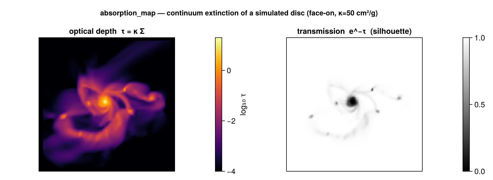

# AMR Grid Overlay & Absorption

!!! tip "Run it yourself"
    This page is also an executable **Jupyter notebook** — [open / download `overlay_absorption.ipynb`](https://github.com/ManuelBehrendt/Notebooks/blob/master/Mera-Docs/version_1/overlay_absorption.ipynb). The notebooks run end-to-end and double as part of Mera's test suite.

Two analysis additions inspired by features in PLUTO's `pyPLUTO` and `yt`: drawing the AMR
grid structure over a map, and a line-of-sight **absorption** (optical-depth / transmission)
map.

## AMR grid overlay

[`gridoverlay`](@ref) returns the **cell-boundary line segments** of the AMR cells at a chosen
refinement `level`, viewed along an axis — the analogue of `yt`'s `annotate_grids` and
pyPLUTO's `oplotbox`. Overlay them on a [`projection`](@ref) or slice to see where the mesh
refines.


```julia
using Mera, CairoMakie

p  = projection(gas, :rho)
go = gridoverlay(gas; level=:max, direction=:z)   # finest-cell boundaries (:max/:min/an integer)

fig = Figure(); ax = Axis(fig[1,1], aspect=DataAspect())
heatmap!(ax, p.maps[:rho])
gridoverlay!(ax, go; color=(:white,0.3))          # convenience helper (needs `using Makie`)
```

`gridoverlay` returns `(segments, extent, level)` — `segments` is a vector of `(x1,y1,x2,y2)`
in the plane coordinates, de-duplicated. Pick a coarser `level` for a sparser overlay; restrict
with `xrange`/`yrange`/`zrange`. (Axis-aligned views `:x`/`:y`/`:z`.)

## Absorption: optical depth & transmission

[`absorption_map`](@ref) is the **absorption** counterpart of [`emission_map`](@ref). It
projects the column density `Σ = ∫ρ dl` with the exact off-axis engine, then returns the
**optical depth** `τ = κ·Σ`, the **transmission** `e^{-τ}`, and the **absorbed fraction**
`1 - e^{-τ}` — a continuum extinction / silhouette image.



```julia
a = absorption_map(gas; kappa=50.0)         # κ = 50 cm²/g (grey/dust-like opacity)
# heatmap of a.transmission  → a silhouette / extinction image
# heatmap of a.tau           → the optical-depth map

a = absorption_map(gas; kappa=50.0, los=fr.los, up=fr.up, center=fr.center)   # off-axis
```

`kappa` is in units inverse to `sd_unit` (default `:g_cm2`, so `κ` is in cm²/g and `τ` is
dimensionless). All [`projection`](@ref) view/region keywords pass through. Returns
`(tau, transmission, absorbed, sd, kappa_eff, extent, los, up, center, pixsize, info)` (`kappa_eff`
is the column-effective opacity `τ/Σ`).

### Variable opacity — `κ` that depends on physics

The opacity is rarely truly grey. `kappa` may instead be **per-cell**, so it can depend on
wavelength, metallicity, gas phase, temperature or ionization. The optical depth is then the exact
`τ = ∫κρ dl = ⟨κ⟩_mass·Σ`:

* a **`Real`** → grey (above);
* a **`Symbol`** → a per-cell opacity *field* — any [`getvar`](@ref) field, an [`add_field`](@ref)-
  registered field, or a raw data column (e.g. a stored metallicity);
* an **`AbstractVector`** → a per-cell opacity (one value per cell), in `kappa_unit` (default cm²/g).

```julia
# wavelength: a Milky-Way dust opacity per gram of gas (see dust_opacity)
a = absorption_map(gas; kappa = dust_opacity(0.55))             # V band ≈ 210 cm²/g

# metallicity-dependent dust, per cell, with a hot-gas (dust-sublimation) cutoff
κcell = dust_opacity(0.44) .* getvar(gas,:metals)./0.0134 .* (getvar(gas,:T,:K) .< 1500)
a = absorption_map(gas; kappa = κcell, los=fr.los, up=fr.up, center=fr.center)

# phase-specific: only one phase absorbs (a registered field or a raw column)
a = absorption_map(gas; kappa = :my_kappa_field)
```

[`dust_opacity(λ_μm; kappa_V=210, Z_over_Zsun=1, beta=1.8)`](@ref) returns an approximate MW
(R_V≈3.1) dust opacity per gram of *gas* at wavelength `λ`, scaling linearly with metallicity — a
convenient way to pick a grey `κ` per band, or to build a per-cell `κ` (multiply by a metallicity
field). It is approximate (one scaled MW curve), not a dust radiative-transfer code.

What `κ` *physically* is — dust extinction (∝ metallicity/dust-to-gas, strongly λ-dependent),
electron (Thomson) scattering (≈0.4 cm²/g, ionized gas), or line/continuum opacity — is your choice;
pick the `κ` (scalar, field, or vector) that matches the source and band.

!!! note "Physical units"
    `τ` is meaningful only when the data have physical units — true for RAMSES, and for PLUTO
    when you load with the run's `UNIT_*` constants (see [Reading PLUTO data](pluto_reader.md)).

A velocity-resolved absorption-**line** spectrum along a sightline (a mock spectrograph) is a
planned follow-up; for now combine this τ with a line-of-sight velocity cube from the
in-development `MeraLosCubes` module (see `dev/loscubes/`).

## See also

- [`emission_map`](@ref) — the emission counterpart (`∫ source·e^{-τ} dl`).
- [`projection`](@ref) — the exact engine both build on.
- [Auto-Frame](galaxyframe.md) — `face_on`/`edge_on` for the view.
