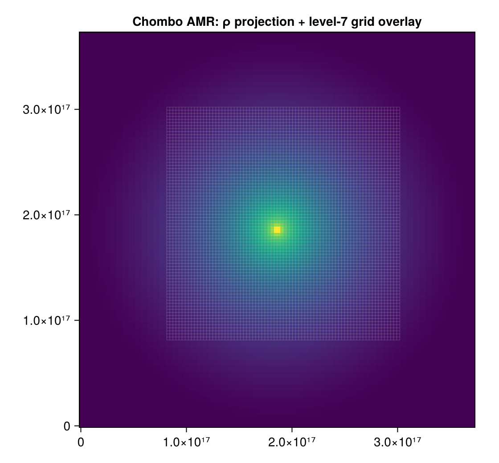

# AMR Grid Overlay

!!! tip "Run it yourself"
    This page is also an executable **Jupyter notebook** — [open / download `overlay_absorption.ipynb`](https://github.com/ManuelBehrendt/Notebooks/blob/master/Mera-Docs/version_1/overlay_absorption.ipynb). The notebooks run end-to-end and double as part of Mera's test suite.

An analysis addition inspired by features in PLUTO's `pyPLUTO` and `yt`: drawing the AMR
grid structure over a map.

## AMR grid overlay

[`gridoverlay`](@ref) returns the **cell-boundary line segments** of the AMR cells at a chosen
refinement `level`, viewed along an axis — the analogue of `yt`'s `annotate_grids` and
pyPLUTO's `oplotbox`. Overlay them on a [`projection`](@ref) or slice to see where the mesh
refines.



```julia
using Mera, CairoMakie

p  = projection(gas, :rho)
go = gridoverlay(gas; level=:max, direction=:z)   # finest-cell boundaries (:max/:min/an integer)

fig = Figure(); ax = Axis(fig[1,1], aspect=DataAspect())
heatmap!(ax, p.maps[:rho])
gridoverlay!(ax, go; color=(:white,0.3))          # convenience helper (needs `using Makie`)
```

`gridoverlay` returns `(segments, extent, level)` — `segments` is a vector of `(x1,y1,x2,y2)`
in the plane coordinates, de-duplicated. Pick a coarser `level` for a sparser overlay; restrict
with `xrange`/`yrange`/`zrange`. (Axis-aligned views `:x`/`:y`/`:z`.)

## Absorption, emission & optical depth

!!! note "Now in an in-development module"
    The line-of-sight **absorption** map (optical depth `τ = κ·Σ`, transmission `e^{-τ}`), the
    **emission+absorption** counterpart, and the `dust_opacity` helper now live in an
    in-development module (`MeraOffAxisSynthObs`, `dev/offaxis_synthobs/`) that ships separately
    from the released Mera package. The exact off-axis [`projection`](@ref) engine they build on
    remains part of Mera.

## See also

- [`projection`](@ref) — the exact engine the overlay and the off-axis tools build on.
- [Auto-Frame](galaxyframe.md) — `face_on`/`edge_on` for the view.
