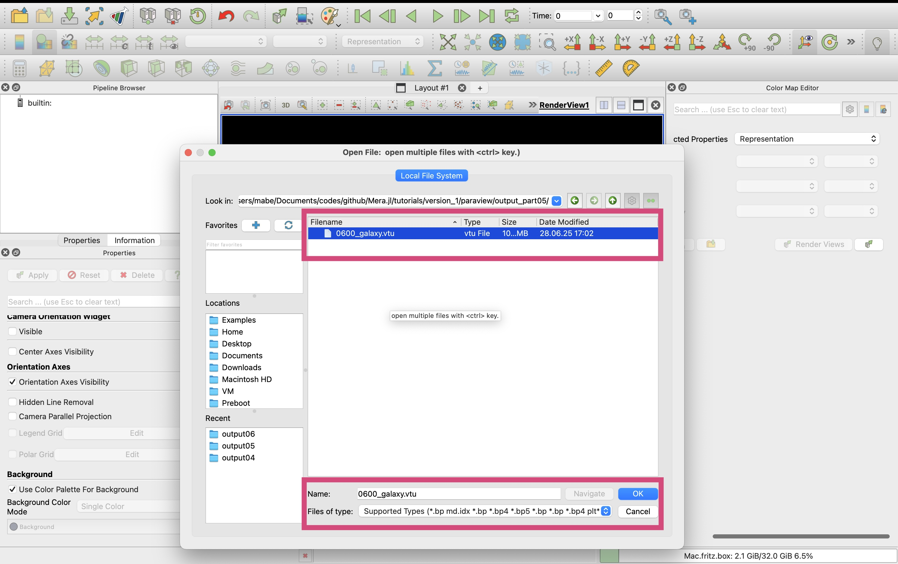
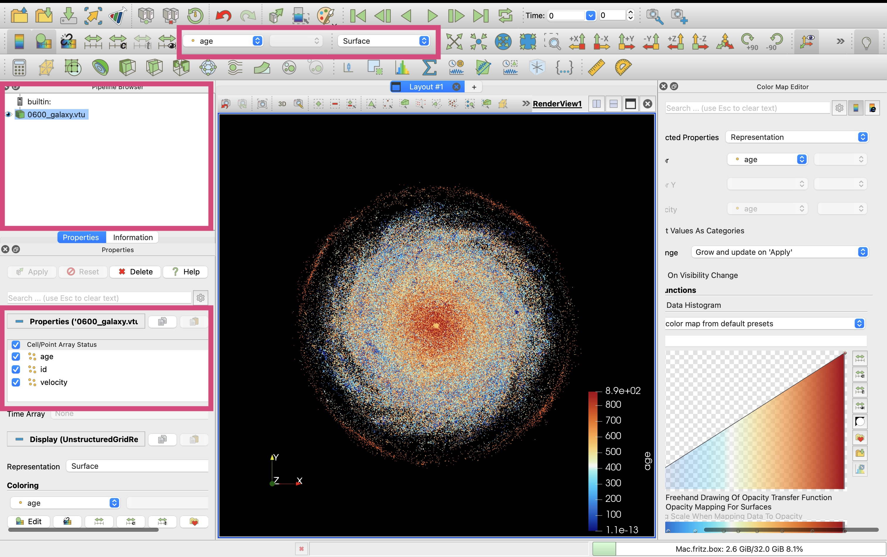

# Particles: Export Selected Variables to VTK

Export particle simulation data to VTK format for advanced 3D visualization in ParaView. This tutorial demonstrates how to convert MERA particle data (stellar particles, dark matter) into VTK point cloud format with customizable variables, units, and coordinate systems.

## Quick Reference

### Essential Functions
```julia
# Basic particle export (default: positions + mass)
export_vtk(particles, "output_prefix")

# Export specific particle properties
export_vtk(particles, "particles_age",
           fields=[:age], fields_unit=[:Myr])

# Export velocity as vector field
export_vtk(particles, "particles_velocity",
           vector=[:vx, :vy, :vz], vector_unit=:km_s,
           vector_name="velocity")

# Combined scalar and vector export
export_vtk(particles, "particles_complete",
           fields=[:age, :mass], fields_unit=[:Myr, :Msol],
           vector=[:vx, :vy, :vz], vector_unit=:km_s, vector_name="velocity")

# Position coordinate control
export_vtk(particles, "particles_kpc",
           fields=[:age], fields_unit=[:Myr],
           positions_unit=:kpc)
```

### Key Parameters
- **`fields`** - Array of particle property symbols: `[:age, :mass, :metallicity]`
- **`fields_unit`** - Corresponding units: `[:Myr, :Msol, :standard]`
- **`vector`** - Vector components: `[:vx, :vy, :vz]`
- **`vector_unit`** - Vector units: `:km_s, :m_s, :pc_Myr`
- **`vector_name`** - ParaView vector name: `"velocity", "magnetic_field"`
- **`positions_unit`** - Coordinate system units: `:kpc, :pc, :au`

### File Output Types
- **`.vtu`** - VTK unstructured grid format (point cloud)
- **Point data** - Each particle becomes a point with associated properties
- **Default export** - Always includes 3D positions; mass included if no fields specified

### Common Particle Properties
- **`:age`** - Stellar age (use with `:Myr` or `:Gyr`)
- **`:mass`** - Particle mass (use with `:Msol`)
- **`:birth`** - Formation time (use with `:Myr`)
- **`:metallicity`** - Metal abundance
- **`:vx, :vy, :vz`** - Velocity components (use with `:km_s`)

### ParaView Workflow
1. **Load Data**: Open `.vtu` files as point clouds
2. **Point Visualization**: Use 3D Glyphs (spheres/arrows) to visualize particles
3. **Vector Visualization**: Use 3D Glyphs or Streamlines for velocity fields
4. **Color Mapping**: Color by age, mass, velocity magnitude, or metallicity
5. **Filtering**: Apply Threshold filters to select particle subsets by properties

## Simulation Overview & Load Particle Data

```julia
import Pkg; Pkg.activate("../.")
```

```
  Activating project at `~/Documents/codes/github/Notebooks/Mera-Docs/version_1`

```

```julia
using Mera
# use compressed Mera file
path = "/Volumes/FASTStorage/Simulations/Mera-Tests/AV5CDhr/";
info = infodata(600, path)
particles = loaddata(600, path, :particles); # load full box
```

```
[Mera]: 2025-08-13T16:57:29.196

Use datatype: hydro
Code: RAMSES
output [600] summary:
mtime: 2024-09-08T15:29:04
ctime: 2024-09-10T11:23:16.230
=======================================================
simulation time: 891.71 [Myr]
boxlen: 48.0 [kpc]
ncpu: 5120
ndim: 3
-------------------------------------------------------
amr:           true
level(s): 6 - 13 --> cellsize(s): 750.0 [pc] - 5.86 [pc]
-------------------------------------------------------
hydro:         true
hydro-variables:  7  --> (:rho, :vx, :vy, :vz, :p, :var6, :var7)
hydro-descriptor: (:density, :velocity_x, :velocity_y, :velocity_z, :pressure, :scalar_00, :scalar_01)
γ: 1.6667
-------------------------------------------------------
gravity:       true
gravity-variables: (:epot, :ax, :ay, :az)
-------------------------------------------------------
particles:     true
- Nstars:   1.353087e+06
particle-variables: 7  --> (:vx, :vy, :vz, :mass, :family, :tag, :birth)
particle-descriptor: (:position_x, :position_y, :position_z, :velocity_x, :velocity_y, :velocity_z, :mass, :identity, :levelp, :family, :tag, :birth_time)
-------------------------------------------------------
rt:            false
clumps:           false
-------------------------------------------------------
namelist-file: ("&COOLING_PARAMS", "&HYDRO_PARAMS", "&SF_PARAMS", "&AMR_PARAMS", "&BOUNDARY_PARAMS", "&OUTPUT_PARAMS", "&POISSON_PARAMS", "&INIT_PARAMS", "&RUN_PARAMS", "&FEEDBACK_PARAMS", "&REFINE_PARAMS")
-------------------------------------------------------
timer-file:       true
compilation-file: true
makefile:         true
patchfile:        true
=======================================================

[Mera]: 2025-08-13T16:57:34.059

Open Mera-file output_00600.jld2:

domain:
xmin::xmax: 0.0 :: 1.0  	==> 0.0 [kpc] :: 48.0 [kpc]
ymin::ymax: 0.0 :: 1.0  	==> 0.0 [kpc] :: 48.0 [kpc]
zmin::zmax: 0.0 :: 1.0  	==> 0.0 [kpc] :: 48.0 [kpc]

Memory used for data table :95.81425380706787 MB
-------------------------------------------------------

```

## Export Scalars

### Standard Export

```julia
# Export full box with all particles (here only stellar particles)

export_vtk(
    particles,                      # loaded data
    "output_part01/0600_galaxy";    # prefix for outputfiles; creates folder output_part01 (if not existing)
    scalars=[:mass, :age],          # load mass data in Msun and particle age data in Myr
    scalars_unit=[:Msun, :Myr],
    scalars_log10=true,             # apply log10 on the scalars
    positions_unit=:kpc,            # particle positions in kpc (useful in Paraview for region selection)
);
```

```
[Mera]: 2025-08-13T16:57:35.947

Available Threads: 1
Created directory: output_part01
Total particles in dataset: 1353087
Extracting particle positions...
Extracting scalar data...
Writing particle VTU file...
  wrote 0600_galaxy.vtu (Size: 73.55 MB)
Memory cleaned

=== Export Summary ===
Particles exported: 1353087
Particle VTU file: 0600_galaxy.vtu
Available scalars: mass, age

```

```julia
readdir("output_part01")
```

```
1-element Vector{String}:
 "0600_galaxy.vtu"
```

```julia
# => in Paraview open the vtu file to load all level data
```

### Export Maximum Number of Particles

```julia
# Export full box (here only stellar particles)
# -> limit the number of particles

export_vtk(
    particles,                      # loaded data
    "output_part03/0600_galaxy";    # prefix for outputfiles; creates folder output_part03 (if not existing)
    scalars=[:age],                 # load age data in Myra
    scalars_unit=[:Myr],
    scalars_log10=true,             # apply log10 on the scalars
    positions_unit=:kpc,            # particle positions in kpc (useful in Paraview for region selection)

    max_particles=1_000             # (caps output if exceeded)
);
```

```
[Mera]: 2025-08-13T16:57:39.682

Available Threads: 1
Created directory: output_part03
Total particles in dataset: 1353087
Limiting export to 1000 particles (from 1353087)
Extracting particle positions...
Extracting scalar data...
Writing particle VTU file...
  wrote 0600_galaxy.vtu (Size: 0.05 MB)
Memory cleaned

=== Export Summary ===
Particles exported: 1000
Particle VTU file: 0600_galaxy.vtu
Available scalars: age

```

```julia
readdir("output_part03")
```

```
1-element Vector{String}:
 "0600_galaxy.vtu"
```

```julia
# => in Paraview open the vtu file to load all level data
```

## Export Scalars and Vector

```julia
# Export full box with particles (here only stellar particles)

export_vtk(
    particles,                      # loaded data
    "output_part04/0600_galaxy";    # prefix for outputfiles; creates folder output_part04 (if not existing)
    scalars=[:age],                 # load age data in Myr
    scalars_unit=[:Msun],
    scalars_log10=true,             # apply log10 on the scalars
    positions_unit=:kpc,            # particle positions in kpc (useful in Paraview for region selection)

    vector=[:vx, :vy, :vz],         # velocity components and its units
    vector_unit=:km_s,
    vector_name="velocity"          # vector name recognized by Paraview
);
```

```
[Mera]: 2025-08-13T16:57:40.008

Available Threads: 1
Created directory: output_part04
Total particles in dataset: 1353087
Extracting particle positions...
Extracting scalar data...
Extracting vector data...
Vector matrix dimensions: (3, 1353087) (should be 3×1353087)
Writing particle VTU file...
  wrote 0600_galaxy.vtu (Size: 94.2 MB)
Memory cleaned

=== Export Summary ===
Particles exported: 1353087
Particle VTU file: 0600_galaxy.vtu
Available scalars: age
Available vector: velocity

```

```julia
readdir("output_part04")
```

```
1-element Vector{String}:
 "0600_galaxy.vtu"
```

```julia
# => in Paraview open
# - the vtu file to load all particle scalar and vector data
```

## Visualisation in Paraview

### Visualize Particles in 3D

```julia
# Export full box with scalars and vector data

export_vtk(
    particles,                      # loaded data
    "output_part05/0600_galaxy";    # prefix for outputfiles; creates folder output05 (if not existing)
    scalars=[:id, :age],            # load density data in cm^-3
    scalars_unit=[:standard, :Myr],
    positions_unit=:kpc,            # particle positions in kpc (useful in Paraview for region selection)

    vector=[:vx, :vy, :vz],         # velocity components and its units
    vector_unit=:km_s,
    vector_name="velocity"          # vector name recognized by Paraview
);
```

```
[Mera]: 2025-08-13T16:57:41.653

Available Threads: 1
Created directory: output_part05
Total particles in dataset: 1353087
Extracting particle positions...
Extracting scalar data...
Extracting vector data...
Vector matrix dimensions: (3, 1353087) (should be 3×1353087)
Writing particle VTU file...
  wrote 0600_galaxy.vtu (Size: 104.52 MB)
Memory cleaned

=== Export Summary ===
Particles exported: 1353087
Particle VTU file: 0600_galaxy.vtu
Available scalars: id, age
Available vector: velocity

```

```julia
readdir("output_part05")
```

```
1-element Vector{String}:
 "0600_galaxy.vtu"
```

**Load Data-File**



**Select age information**



```julia
# => save state
```

### Visualize Particles & Vectors

**Select Glyphs, arrow orientation, number of sample points**


```julia
# => save state
```
