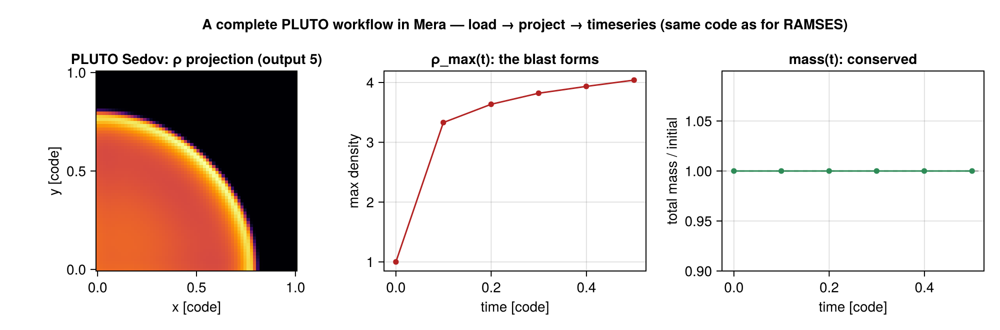
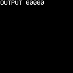
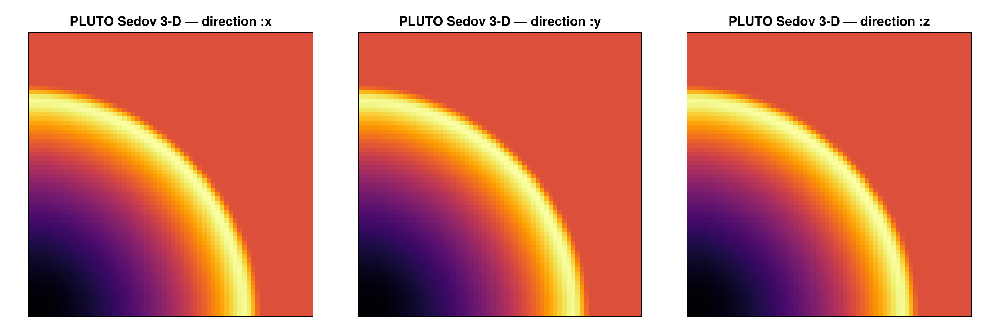
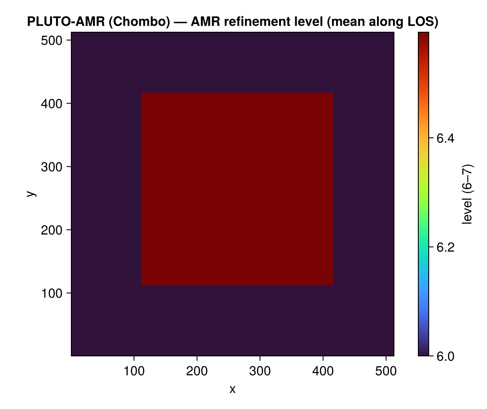

# Reading PLUTO data (experimental)

Mera's analysis began as a RAMSES tool, but the analysis layer is **code-blind**: it works on
a generic uniform/AMR cell list, not on RAMSES file formats. This page adds a **frontend for
the [PLUTO code](http://plutocode.ph.unito.it)** that reads PLUTO's static-grid output into
the same Mera structs — so [`getvar`](@ref), [`projection`](@ref), [`pdf`](@ref),
[`timeseries`](@ref), and the rest run on PLUTO data unchanged.

!!! note "Two formats, one analysis"
    The frontend reads **both** of PLUTO's output formats into the same Mera structs:
    static **uniform grids** (`grid.out` + `.dbl`) and **AMR** (the Chombo `.hdf5` format, see
    [below](#PLUTO-AMR-(Chombo))). Scope: 3-D, Cartesian, power-of-two base grid. PLUTO test
    problems are dimensionless, so data load in **code units**.

## Usage

The normal [`getinfo`](@ref) / [`gethydro`](@ref) entry points **auto-detect the code** —
nothing special to call:

```julia
julia> info = getinfo(5, "/data/pluto_sedov3d");   # detects PLUTO (grid.out + dbl.out)

Code: PLUTO
output: 5  time: 0.5 [code units]
grid: 64³ uniform Cartesian, level 6, boxlen = 1.0
variables: (rho, vx, vy, vz, p)
-------------------------------------------------------

julia> gas = gethydro(info);                        # branches on info.simcode → the PLUTO frontend
```

The overview reports the code, the uniform `64³` grid (mapped to Mera `level = log₂64 = 6`), the
box length and the variable list — the same overview a RAMSES snapshot prints.

`getinfo` sniffs the directory for each code's signature files; the detected code is stored in
`info.simcode` (`"PLUTO"` / `"RAMSES"`) and printed in the overview. Force it with `code=`:

```julia
info = getinfo(5, path; code=:pluto)        # or :ramses, or :auto (the default)
```

The low-level frontend functions are also exported if you want them directly:
`getinfo_pluto(output, path)` and `gethydro_pluto(info)`.

`gethydro` honours the RAMSES **spatial-window** arguments `xrange`/`yrange`/`zrange` (with
`center`/`range_unit`), so you can load only the part of the box you need — the same selection the
upstream readers offer (see [Reference readers](#Reference-readers)):

```julia
gas = gethydro(info; xrange=[0.0, 0.5], yrange=[0.25, 0.75], range_unit=:standard)  # a sub-box
```

The selection acts on the **leaf cells**, so it is an exact, hole-free filter and the returned
object records the window in `gas.ranges`; resolution is chosen later at analysis time
(`projection(…, res=)`), not at load.

!!! note "What is available per data type"
    Data is loaded per type, exactly as for RAMSES: [`gethydro`](@ref) always, and
    [`getparticles`](@ref) when a PLUTO particle file is present (`info.particles == true`).
    PLUTO snapshots carry no separate gravity dataset.

`gas` is an ordinary `HydroDataType` (uniform grid, columns `:cx,:cy,:cz, :rho,:vx,:vy,:vz,:p`),
identical in shape to what the RAMSES uniform-grid reader produces. Everything downstream just
works:

```julia
msum(gas, :Msol)                       # (code units here)
projection(gas, :rho)                  # the exact off-axis projection engine
pdf(gas, :rho)                         # density PDF
p = face_on(gas); projection(gas, :sd; los=p.los, up=p.up, center=p.center)
```

## What it reads

PLUTO's **static-grid** output (the format documented by PLUTO's own `pyPLUTO` reader):

- **`grid.out`** — geometry, per-axis cell count and edges → the cell centres.
- **`dbl.out`** — one row per snapshot: time, file mode (`single_file`), endianness, and the
  variable names.
- **`data.NNNN.dbl`** — the raw double-precision data (single-file, x1 fastest).

PLUTO variable names are mapped to Mera's canonical symbols: `rho→:rho`, `vx1/vx2/vx3→:vx/:vy/:vz`,
`prs→:p` (and `bx1/2/3→:bx/:by/:bz` for MHD).

## How it fits Mera's architecture

The frontend is a **sibling reader**: it fills the existing `InfoType` / `HydroDataType`
structs (`simcode = "PLUTO"`, `levelmin == levelmax`, `boxlen`, the `scale`, the cell table in
the RAMSES coordinate convention). It changes **nothing** in the analysis layer — that is the
whole point. The one thing the reader must get exactly right is the cell-coordinate mapping
(`cell centre = (c − 0.5)·boxlen/2^level`); the reader is validated against `pyPLUTO` (the
density peak and every value match cell-for-cell).

This is the proof-of-concept for multi-code support: a new code = "write a reader that fills
the structs," not "rework Mera." Other Eulerian codes (Enzo, FLASH, Athena++) can follow the
same pattern.

## A complete PLUTO workflow

Because PLUTO data lands in the standard structs, the *entire* Mera workflow runs on it —
identical to the RAMSES tutorials. Here is load → inspect → projection → time-series → movie →
PDF, end to end, on a 3-D Sedov blast (6 PLUTO outputs):



```julia
using Mera

path = "/data/pluto_sedov3d"

# 1. load — getinfo auto-detects PLUTO and prints "Code: PLUTO"
info = getinfo(5, path)
gas  = gethydro(info)

# 2. inspect / derive quantities — getvar works unchanged
extrema(getvar(gas, :rho))          # density range
getvar(gas, :cellsize)[1]           # = boxlen / 2^level
msum(gas)                           # total mass (code units)

# 3. projection (the exact off-axis engine)
p = projection(gas, :sd, res=512, center=[:bc], direction=:z)
# heatmap of log10.(p.maps[:sd]) over p.extent  → the blast's shock front

# 4. time-series over all 6 outputs (discovery reads PLUTO's dbl.out)
ts = timeseries(path, d -> (rho_max = maximum(getvar(d, :rho)), mass = msum(d));
                time_unit = :standard)
#   columns: output | time | rho_max | mass   (ρ_max rises 1 → 4 as the blast forms)

# 5. a movie of the blast (frames from the 6 outputs → GIF)
mv = getmovie(path, :rho; time_unit = :standard)
savemovie(mv, "pluto_blast.gif"; tags = :output)

# 6. the density PDF
P = pdf(gas, :rho)

# 7. persist a map / cube the JLD2 way (opens in h5py too)
savemap(p, "pluto_rho.jld2")
```



Projecting the loaded blast along each axis shows the spherical shock front directly — the
column density rendered along `x`, `y` and `z` with the same [`projection`](@ref) call used for
RAMSES (the Sedov test runs in one octant, so the shell appears as a quarter-circle from each
direction).

!!! details "Show the CairoMakie code"
    ```julia
    using CairoMakie

    fig = Figure(size=(1150, 380))
    for (i, dir) in enumerate((:x, :y, :z))
        Σ  = projection(gas, :sd, res=512, center=[:bc], direction=dir).maps[:sd]
        ax = Axis(fig[1, i]; title="PLUTO Sedov 3-D — direction :$dir", aspect=DataAspect())
        hidedecorations!(ax)
        heatmap!(ax, log10.(Σ' .+ 1e-30); colormap=:inferno)   # transpose: array (col,row) → (x,y)
    end
    save("pluto_projection.png", fig, px_per_unit=2)
    ```



Every step above is the same call you would make on a RAMSES snapshot — that is the whole
point of the code-blind analysis layer.

## PLUTO particles

If a PLUTO run wrote Lagrangian particles (`particles.NNNN.dbl`), `getinfo` flags them and
`getparticles` reads them into a Mera `PartDataType` — so the particle analysis runs unchanged:

```julia
info = getinfo(5, "/data/pluto_run")     # info.particles == true if a particle file is present
part = getparticles(info)                 # → PartDataType (:x,:y,:z, :id, :vx,:vy,:vz, …)
getvar(part, :vx); msum(part)             # the usual particle analysis
```

The PLUTO particle format (an ASCII `#` header — `field_names`/`field_dim`/`nparticles`/
`endianity` — followed by particle-major binary) is read directly; field names map to Mera
symbols (`x1→:x`, `vx1→:vx`, …), extra fields keep their names.

## PLUTO AMR (Chombo)

PLUTO's **AMR** output uses the Chombo box-structured HDF5 format (shared with Orion and other
Chombo codes). The frontend reads it too — `getinfo` auto-detects a `.hdf5` snapshot and loads
the level hierarchy as a Mera **AMR** `HydroDataType`:

```julia
info = getinfo(0, "/data/chombo_run")    # detects the Chombo .hdf5 → "Code: CHOMBO"
gas  = gethydro(info)                      # → AMR HydroDataType (a :level column)
projection(gas, :rho)                      # the analysis runs unchanged on AMR data
```

The reader flattens the levels to a **leaf-cell** list (a coarse cell is kept only where it is
*not* refined by a finer level) and maps each cell to Mera's `(level, cx, cy, cz)` convention —
Chombo level-0 of `N₀` cells per axis becomes Mera level `log₂N₀`, each finer level adds one
(`ref_ratio = 2`). Variable names are mapped per code: PLUTO (`rho`, `vx1…`, `prs`) directly;
Orion (`density`, `X/Y/Z-momentum`, `energy-density`) with velocity = momentum/density and
pressure derived from the energy. The leaf extraction is validated cell-for-cell against an
independent reader.

Because the `:level` column survives into the standard struct, the **AMR structure is itself
plottable** — a volume-weighted mean level along the line of sight shows where the grid refines
(here a self-gravitating isothermal sphere refined toward its centre, Mera levels 6 → 7). The full
[CairoMakie](https://docs.makie.org) code is identical to the Athena++ AMR map:

!!! details "Show the CairoMakie code"
    ```julia
    using CairoMakie

    m = projection(gas, :level, res=512, center=[:bc], direction=:z, weighting=[:volume]).maps[:level]

    fig = Figure(size=(560, 470))
    ax  = Axis(fig[1,1]; title="PLUTO-AMR (Chombo) — AMR refinement level (mean along LOS)",
               xlabel="x", ylabel="y", aspect=DataAspect())
    hm  = heatmap!(ax, m; colormap=:turbo)
    Colorbar(fig[1,2], hm, label="level (6–7)")
    save("pluto_amr_levels.png", fig, px_per_unit=2)
    ```



HDF5 reading uses `HDF5.jl` (a dependency of Mera). Requires a power-of-two base grid and
`ref_ratio = 2` (the common PLUTO/Chombo case).

## Reference readers

This frontend is built to agree with the *origin* tools — the readers that define PLUTO's output
formats and their selection semantics:

- **`pyPLUTO`** — PLUTO's own Python reader, which documents the static-grid (`grid.out` + `.dbl`)
  layout this frontend parses. Mera's coordinate mapping is validated against it cell-for-cell.
- **[yt](https://yt-project.org)** — reads PLUTO's Chombo-HDF5 AMR output through its `chombo`
  frontend, and selects sub-volumes lazily via *data objects* (`ds.box`, `ds.sphere`, `ds.r[...]`).
  Mera's load-time `xrange`/`yrange`/`zrange` mirrors that region-selector behaviour on the
  leaf-cell list.

PLUTO test problems are dimensionless (code units) and carry no CGS factors — exactly as both
readers above assume; the run's units live in its compiled `definitions.h`, not in the snapshot.

## See also

- [`getvar`](@ref), [`projection`](@ref), [`pdf`](@ref), [`timeseries`](@ref), [`getmovie`](@ref) — the analysis that now runs on PLUTO data.
- [`getinfo`](@ref) / [`gethydro`](@ref) — the RAMSES equivalents this mirrors.
