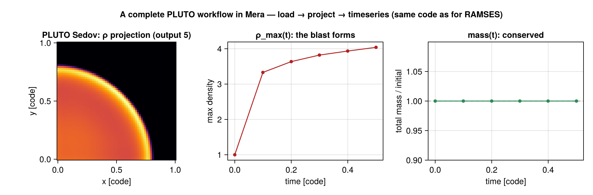
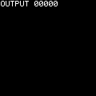
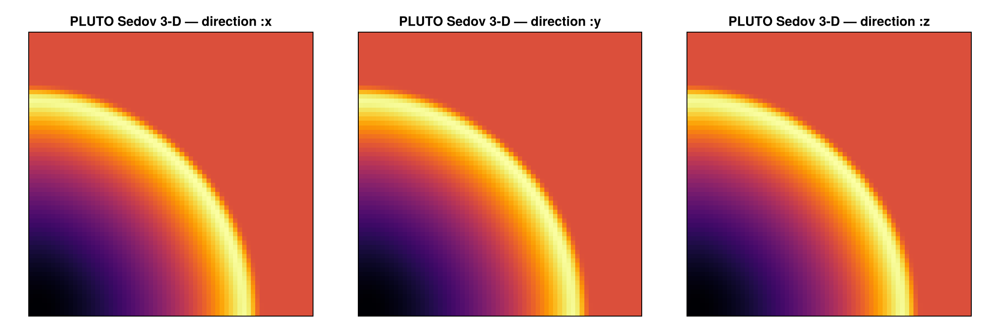

# Reading PLUTO data (experimental)

Mera's analysis layer is **code-blind**: it works on a generic uniform/AMR cell list, not on RAMSES
file formats. This page adds a **frontend for the [PLUTO code](http://plutocode.ph.unito.it)** that
reads PLUTO's output into the same Mera structs, so [`getvar`](@ref), [`projection`](@ref),
[`pdf`](@ref), [`timeseries`](@ref), [`getmovie`](@ref) and the rest run on PLUTO data unchanged.

!!! note "Two formats, one analysis"
    The frontend reads **both** of PLUTO's output formats into the same structs: the static
    **uniform grid** (`grid.out` + `.dbl`) and the **AMR** Chombo `.hdf5` format (see
    [PLUTO-AMR (Chombo)](#PLUTO-AMR-(Chombo))). Scope: 3-D Cartesian, power-of-two base grid. PLUTO
    test problems are dimensionless, so data load in **code units**.

## Usage

The normal [`getinfo`](@ref) / [`gethydro`](@ref) entry points **auto-detect** PLUTO from its
signature files (`grid.out` + `dbl.out`), nothing special to call:

```julia
julia> info = getinfo(5, "/data/pluto_sedov3d");   # detects PLUTO

Code: PLUTO
output: 5  time: 0.5 [code units]
grid: 64³ uniform Cartesian, level 6, boxlen = 1.0
variables: (rho, vx, vy, vz, p)
-------------------------------------------------------

julia> gas = gethydro(info);                        # → the PLUTO frontend, code-blind downstream
```

The overview reports the code, the uniform `64³` grid (mapped to Mera `level = log₂64 = 6`), the box
length and the variable list, the same overview a RAMSES snapshot prints. `gas` is an ordinary
`HydroDataType` (columns `:cx,:cy,:cz, :rho,:vx,:vy,:vz,:p`), so the whole analysis layer works:

```julia
msum(gas, :Msol); projection(gas, :rho); pdf(gas, :rho)      # the usual calls, unchanged
```

Force the code with `code=` (`:pluto` / `:chombo` / `:ramses` / `:auto`), or call the frontend
directly with [`getinfo_pluto`](@ref) / [`gethydro_pluto`](@ref).

### Loading a spatial sub-region

`gethydro` honours the RAMSES **spatial-window** arguments `xrange`/`yrange`/`zrange` (with
`center`/`range_unit`), so you load only the part of the box you need:

```julia
gas = gethydro(info; xrange=[0.0, 0.5], yrange=[0.25, 0.75], range_unit=:standard)   # a sub-box
```

The selection acts on the cells, so it is an exact filter and the returned object records the window
in `gas.ranges`; resolution is chosen later at analysis time (`projection(…, pxsize=…)`), not at load.

!!! note "What is available per data type"
    Data is loaded per type, exactly as for RAMSES: [`gethydro`](@ref) always, and
    [`getparticles`](@ref) when a PLUTO particle file is present (`info.particles == true`). PLUTO
    snapshots carry no separate gravity dataset.

## Worked example: the 3-D Sedov blast

Because PLUTO data lands in the standard structs, the *entire* Mera workflow runs on it, identical
to the RAMSES tutorials. Here is load → inspect → projection → time-series → movie → PDF, end to end,
on a 3-D Sedov blast (6 PLUTO outputs):



```julia
using Mera
path = "/data/pluto_sedov3d"

info = getinfo(5, path); gas = gethydro(info)              # 1. load (auto-detects PLUTO)

extrema(getvar(gas, :rho))                                 # 2. inspect — getvar works unchanged
getvar(gas, :cellsize)[1]                                  #    = boxlen / 2^level
msum(gas)                                                  #    total mass (code units)

p = projection(gas, :sd, pxsize=[0.002, :standard], center=[:bc], direction=:z)   # 3. projection

ts = timeseries(path, d -> (rho_max = maximum(getvar(d, :rho)), mass = msum(d));   # 4. time series
                time_unit = :standard)                     #    over all 6 outputs (reads dbl.out)

mv = getmovie(path, :rho; time_unit = :standard)           # 5. movie of the blast → GIF
savemovie(mv, "pluto_blast.gif"; tags = :output)

P = pdf(gas, :rho)                                         # 6. density PDF
savemap(p, "pluto_rho.jld2")                               # 7. persist a map (Mera-native, reload with loadmap)
```



Projecting the loaded blast along each axis shows the spherical shock front directly (the Sedov test
runs in one octant, so the shell appears as a quarter-circle from each direction):



Every step above is the same call you would make on a RAMSES snapshot. That is the whole point of
the code-blind analysis layer.

## Units

PLUTO writes data in **code units** and does not store its `UNIT_*` constants in the output (they
live in the run's compiled `definitions.h`), so by default the run is treated as dimensionless. Pass
PLUTO's `UNIT_LENGTH`/`UNIT_DENSITY`/`UNIT_VELOCITY` (in **CGS**) to make every `getvar`/`projection`
conversion physical:

```julia
# e.g. UNIT_LENGTH = 1 pc, UNIT_DENSITY = m_p, UNIT_VELOCITY = 1 km/s
info = getinfo_pluto(5, path; unit_length=3.086e18, unit_density=1.67e-24, unit_velocity=1e5)
getvar(gethydro(info), :x, :pc)            # now physically correct
```

## Variable names

PLUTO variable names are mapped to Mera's canonical symbols: `rho→:rho`, `vx1/vx2/vx3→:vx/:vy/:vz`,
`prs→:p`, and `bx1/2/3→:bx/:by/:bz` for MHD. Unmapped names pass through as-is.

## How it maps onto Mera's grid

The frontend reads PLUTO's **static-grid** output (the format documented by PLUTO's own `pyPLUTO`
reader):

- **`grid.out`**: geometry, per-axis cell count and edges → the cell centres.
- **`dbl.out`**: one row per snapshot: time, file mode (`single_file`), endianness, variable names.
- **`data.NNNN.dbl`**: the raw double-precision data (single-file, x1 fastest).

It fills the existing `InfoType` / `HydroDataType` (`simcode = "PLUTO"`, `levelmin == levelmax`,
`boxlen`, the `scale`, the cell table in the RAMSES convention). The one thing the reader must get
exactly right is the cell-coordinate mapping (`cell centre = (c − 0.5)·boxlen/2^level`). The test
suite pins it: `grid.out` cell centres are parsed and compared against the values the format
defines, and a synthetic snapshot is written and read back so a shifted index cannot pass.

## PLUTO particles

If a PLUTO run wrote Lagrangian particles (`particles.NNNN.dbl`), `getinfo` flags them and
[`getparticles`](@ref) reads them into a Mera `PartDataType`, so the particle analysis runs
unchanged:

```julia
info = getinfo(5, "/data/pluto_run")      # info.particles == true if a particle file is present
part = getparticles(info)                  # → PartDataType (:x,:y,:z, :id, :vx,:vy,:vz, …)
getvar(part, :vx); length(part.data)       # velocities, and how many particles were read
```

!!! warning "PLUTO particles carry no mass"
    PLUTO particle files store no mass field, so Mera's PLUTO `PartDataType` has no `:mass`
    column. Anything mass-weighted has no input here: [`msum`](@ref), [`center_of_mass`](@ref),
    [`bulk_velocity`](@ref) and the default `projection(part, :sd)` weighting. Work with counts
    instead, or attach a mass column yourself if your run uses a constant particle mass.

The format (an ASCII `#` header, `field_names`/`field_dim`/`nparticles`/`endianity`, followed by
particle-major binary) is read directly; field names map to Mera symbols (`x1→:x`, `vx1→:vx`, …),
extra fields keep their names.

## PLUTO-AMR (Chombo)

PLUTO's AMR mode writes Chombo HDF5 rather than the static-grid format above, and Mera reads
it through a separate frontend. See [Chombo](chombo_reader.md).

## Reference readers

This frontend is built to agree with the *origin* tools, the readers that define PLUTO's formats:

- **`pyPLUTO`**, PLUTO's own Python reader, documents the static-grid (`grid.out` + `.dbl`) layout
  that Mera's coordinate mapping follows.
- **[yt](https://yt-project.org)** reads PLUTO's Chombo-HDF5 AMR output through its `chombo`
  frontend, selecting sub-volumes lazily via *data objects* (`ds.box`, `ds.sphere`, `ds.r[...]`).
  Mera's load-time `xrange`/`yrange`/`zrange` selects at the same stage.

## See also

- [Multi-code support](multicode.md), the code-blind architecture and the sibling readers.
- [`getvar`](@ref), [`projection`](@ref), [`pdf`](@ref), [`timeseries`](@ref), [`getmovie`](@ref), the analysis that runs on PLUTO data.
