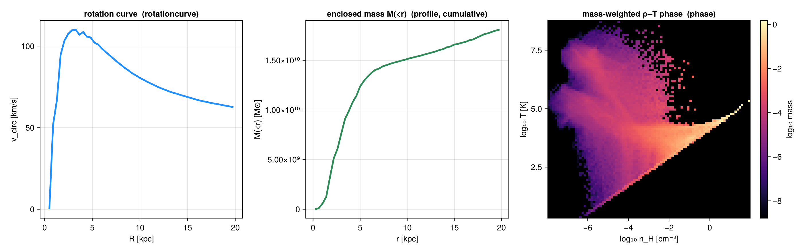

# Profiles & Phase Diagrams

!!! tip "Step-by-step tutorial"
    For a runnable walk-through (radial/vertical profiles, per-bin statistics, mass vs volume
    weighting, stars/gravity, profiles from 2-D maps, phase diagrams), see the
    [Profiles & phase diagrams tutorial](15_multi_Profiles_Phase.md).

`profile` and `phase` are **general weighted reductions** over any `getvar` fields — they are not
tied to projection or to a line of sight. A *profile* bins the data by one field; a *phase
diagram* is a 2D weighted histogram of two fields. They work on

* **3D data** — hydro, gravity, particles and clumps, using each type's available fields. (Gravity
  carries no `:mass`, so weight by `:volume`/`:none`; clumps expose only their stored columns —
  `:mass`, `:peak_x/y/z`, `:rho_av`, … — not derived coordinates like `:r_cylinder`.)
* **projected 2D maps** — a [`projection`](@ref) result, via `profile(m::DataMapsType, …)` /
  `phase(m::DataMapsType, …)` (the returns carry `source=:map`); see the tutorial.

Over the **full data range** (the default `xrange`) the binned weights sum to the grand total — e.g.
a radial mass profile sums to the total mass. Restricting `xrange`/`edges` instead sums only the
weight **inside that range**.



## What you can compute

A profile is configurable along a few **independent** axes — mix and match freely.

**Data source** — 3-D data (`profile(obj, …)`) or a projected 2-D map (`profile(m::DataMapsType, …)`).

**Per-bin reduction** — with a `yvar`, every bin returns *all* of these at once:

| reduction | field(s) | notes |
|---|---|---|
| count / summed weight | `count`, `sum`, `sumw2` | always returned; `sum` = Σweight (the mass/volume/… profile) |
| weighted mean | `mean` | |
| standard deviation | `std` | weight-weighted |
| standard error of the mean | `sem`, `neff` | `sem = std/√neff` (Kish effective sample size) |
| median & **percentiles** | `median`, `quantiles`, `qlevels` | weighted; set the levels via `quantiles=[…]` |
| **extrema** | `min`, `max` | |
| **shape moments** | `skewness`, `kurtosis` | weighted; `kurtosis` is **excess** (0 for a Gaussian) |
| custom | `custom` | `statistic = f(yview, wview)` (or `f(yview)`) |

**Weighting** — `weight = :mass` · `:volume` (grid only) · `:none` (equal cells) · any field. (Should
be non-negative.)
**Binning** — `nbins` + `xrange` + `scale=:linear`/`:log`/**`:equal`** (quantile-spaced *adaptive*
bins, ~equal count per bin — robust for sparse outer radii / noisy data), or explicit `edges=[…]`.
**Reference point** — `center` in `center_unit` (e.g. `center=[24,24,24], center_unit=:kpc`); the
binning-axis unit is `xunit`, **not** `center_unit` (the axis can be any quantity). `range_unit` is
a back-compat alias of `center_unit`.

**One-line transforms** (opt-in):

| want | kwarg | adds |
|---|---|---|
| physical density ρ(r) / Σ(R) | `geometry=:spherical` / `:cylindrical` | `shell_volume`, `density` |
| **cumulative** / enclosed M(<r) | `cumulative=:forward` / `:reverse` | `cumsum`, `cumcount` |
| normalized histogram (fractions / **PDF**) | `normalize=:sum` / `:pdf` | `fraction`, `pdf` |
| **bootstrap uncertainties** | `bootstrap=N` (`ci=:percentile`/`:basic`/`:bca`) | `mean_ci`, `median_ci` (`nbins×2`), `median_se` |
| **several fields in one pass** | `yvar = [:a, :b]` | `fields[:a]`, `fields[:b]`, `yvars` |

**Normalizations — fractions, PDFs & density PDFs.** With no `yvar`, the binned `sum` is a histogram
of `weight`; `normalize=:sum` → `fraction = sum/Σsum` (bins add to 1); `normalize=:pdf` →
`pdf = fraction/Δedge` (a true probability density, ∫ = 1, bin-width independent). The classic case is
the **density PDF** — bin *by* `:rho` and normalize; `weight=:mass` vs `:volume` give the mass- vs
volume-weighted ρ-PDF. The same `normalize=:pdf` makes a 2-D PDF in `phase` and a 3-D PDF in
`profile3d`. *(Worked, plotted example: tutorial §3.)*

**Bin widths by count, physical size, or population.** Set bins by **count** (`nbins`+`xrange`),
**physical width** (`binsize`), or explicit `edges`:

| you want | pass | note |
|---|---|---|
| `n` bins over a range | `nbins=40, xrange=(0,20)` | default |
| a fixed width Δ (in `xunit`) | `binsize=0.5` | e.g. 0.5-kpc radial bins; overrides `nbins` |
| a width with its own unit | `binsize=(500,:pc)` | converted to `xunit`; final bin may be short (keeps the top edge) |
| a fixed **dex** step (log) | `scale=:log, binsize=0.25` | log10-spaced; `binsize` is a dimensionless dex step |
| ~equal points per bin | `scale=:equal` | quantile-spaced adaptive bins (no `binsize`) |
| exact edges | `edges=[…]` | in `xunit`; wins over everything |

(`phase`/`profile3d` take per-axis `xbinsize`/`ybinsize`/`zbinsize`.)

### Result fields — quick reference

What a `profile` returns (a `NamedTuple`; only the relevant fields are present):

| field(s) | shape | when |
|---|---|---|
| `x`, `edges`, `count`, `sum`, `sumw2` | `nbins` (`edges`: `nbins+1`) | **always** (`sum` = Σweight) |
| `mean`, `std`, `var`, `sem`, `neff`, `min`, `max`, `median`, `skewness`, `kurtosis` | `nbins` | with a `yvar` |
| `quantiles`, `qlevels` | `nbins×nq`, `nq` | with a `yvar` |
| `shell_volume`, `density` | `nbins` | `geometry=:spherical`/`:cylindrical` |
| `cumsum`, `cumcount` | `nbins` | `cumulative=:forward`/`:reverse` |
| `fraction` (`+ pdf`) | `nbins` | `normalize=:sum` (`:pdf`) |
| `mean_ci`, `median_ci`, `median_se`, `ci_level`, `ci_method`, `nboot` | `nbins×2` / `nbins` | `bootstrap=N` |
| `custom` | `nbins` | `statistic=f` |
| `fields[:name]`, `yvars` | per field | vector `yvar` (each field nests the per-bin stats above) |
| `weight`, `xvar`, `yvar`, `xunit`, `unit`, `source` | — | provenance (`weight=:vector` for a raw-vector weight) |

### Choosing the tool

| tool | bins | output | per-bin value | typical use |
|---|---|---|---|---|
| `profile(obj, x[, y])` | 1 | `nbins` | Σweight, or stats of `y` | radial ρ(r), rotation curve, ⟨T⟩(r), PDFs |
| `phase(obj, x, y[, c])` | 2 | `nbins²` (`H`) | joint Σweight; `cstat` of `c` | ρ–T diagram, joint PDF |
| `profile3d(obj, x, y, z[, c])` | 3 | `nbins³` (`H`) | joint Σweight; `cstat` of `c` | ρ–T–Z cube; marginal ≡ `phase` |
| `rotationcurve(obj)` | 1 (radius) | `nbins` | `v_circ=√(GM(<r)/r)` ≥ 0 | dynamical (mass-based) rotation curve |
| `velocitydispersion(obj)` | 1 (radius) | `nbins` | σ_R/σ_φ/σ_z + total σ | kinematic dispersion profile |
| `profiletimeseries(loadfn, outs, …)` | 1 × snapshots | `nbins×nsnap` | a profile per snapshot | radius-vs-time evolution |

!!! note "Conditional vs joint — `profile` vs `phase`"
    `profile(gas, :rho, :T)` is the **conditional** ⟨T⟩(ρ) — one curve, the mean of `T` *given* ρ.
    `phase(gas, :rho, :T)` is the **joint** distribution `H[ρ,T]`. They agree at the margin:
    `sum(phase.H, dims=2)` equals `profile(gas, :rho).sum` on the same x-edges.

### Velocity dispersion

The per-bin `std` of a velocity *component* is already its **rest-frame** kinematic dispersion
(weighted variance about the per-bin mean — net rotation/streaming does **not** inflate it), so
`profile(gas, :r_cylinder, :vz).std` is σ_z(R), `…, :vϕ_cylinder).std` is σ_φ(R), etc.
[`velocitydispersion`](@ref) is a convenience wrapper that returns σ_R / σ_φ / σ_z (cylindrical by
default) and the total σ = √(σ_R²+σ_φ²+σ_z²) in one call. *(Worked example: tutorial §7.)*

!!! note "Kinematic ⟨v_ϕ⟩ vs dynamical v_circ"
    A *kinematic* rotation curve — the binned mean azimuthal velocity, `profile(gas, :r_cylinder,
    :vϕ_cylinder)` — carries the disk's **rotation sense**, so it can be **negative** (this galaxy's
    ⟨v_ϕ⟩ ≈ −230…−100 km/s). The *dynamical* `rotationcurve` returns the speed `√(G·M/r) ≥ 0` (a
    **spherical** idealization — for the disk-flattening-exact curve use the gravity field's
    `:ar_cylinder`, tutorial §6). Plot `abs.(mean)` if you want a positive kinematic curve.

## Profiles from 2-D maps

`profile(m::DataMapsType, var; xvar=:r, …)` bins the pixels of a [`projection`](@ref) result — a
surface-brightness Σ(R), a column-weighted `vlos(R)` (`weight=:sd`), a σlos(R), or any map vs any map.
It works for axis-aligned **and off-axis** maps: `xvar=:r` measures radius from the **object centre**
(the map's `cextent`/pivot), so the profile is correctly centred for asymmetric FOVs and off-axis
views; pass `center=[cx,cy]` (camera-plane, in `center_unit`) to offset it. *(Worked examples,
including off-axis: tutorial §9.)*

These are box-axis / camera-independent reductions; for line-of-sight distributions (per-pixel
spectra, velocity cubes) see the [Off-axis Projection](06_offaxis_Projection.md) guide.

## API

```@docs
profile
phase
profile3d
rotationcurve
velocitydispersion
profiletimeseries
getparticlemask
```
