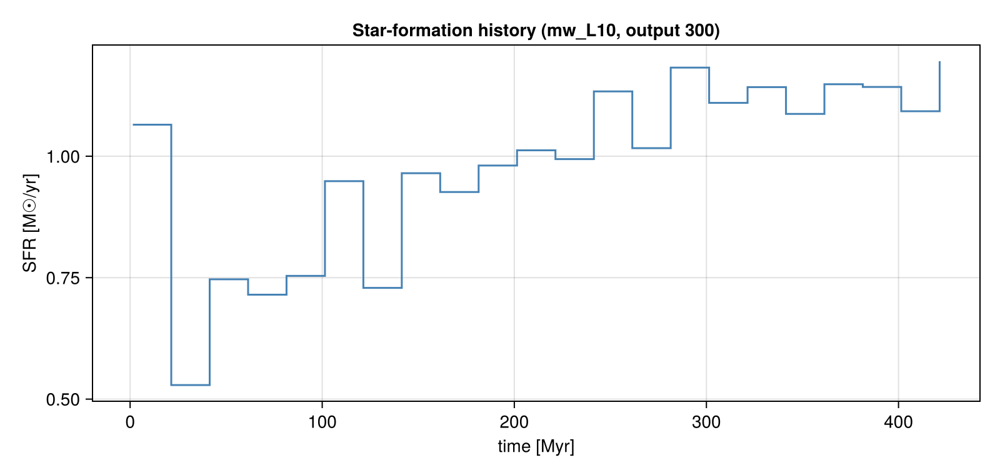

# Star-Formation Rate

!!! tip "Run it yourself"
    This page is also an executable **Jupyter notebook** — [open / download `sfr.ipynb`](https://github.com/ManuelBehrendt/Notebooks/blob/master/Mera-Docs/version_1.1/sfr.ipynb). The notebooks run end-to-end and double as part of Mera's test suite.

Mera measures star formation directly from the **star particles**, in two complementary ways:

* `sfr` — the **star-formation history** SFR(t): stellar mass formed per time bin, in M☉/yr.
* `sfr_snapshot` — the **current SFR** from a single snapshot: mass formed within recent look-back
  windows (the observational "current SFR", e.g. Hα ≈ 5–10 Myr, FUV ≈ 100 Myr), plus the
  lifetime-averaged rate.

Star particles are selected by the universal sentinel **`birth ≠ 0`**; the formation-time axis is
always physical (non-cosmological runs use the proper birth time, cosmological runs convert via the
Friedmann table). This notebook runs on the non-cosmological `mw_L10` disk galaxy (output 300), which
carries star particles.

> Companion to the [Star-Formation Rate](https://github.com/ManuelBehrendt/Mera.jl) doc page.

```julia
using Mera
base = get(ENV, "MERA_TEST_DATA", "/Volumes/FASTStorage/Simulations/Mera-Tests")

info  = getinfo(300, joinpath(base, "RAMSES/mw_L10"))
parts = getparticles(info)
gas   = gethydro(info)
println("particles loaded : ", length(parts.data))
println("hydro cells      : ", length(gas.data))
```


```
*__   __ _______ ______   _______ 
```


```
|  |_|  |       |    _ | |   _   |
|       |    ___|   | || |  |_|  |
|       |   |___|   |_||_|       |
|       |    ___|    __  |       |
| ||_|| |   |___|   |  | |   _   |
|_|   |_|_______|___|  |_|__| |__|
Mera v1.8.0
```


```
[Mera]: 2026-07-31T21:50:26.657
```


```
Code: RAMSES
```


```
output [300] summary:
mtime: 2023-04-09T05:34:09
ctime: 2025-06-21T18:31:24.020
=======================================================
simulation time: 445.89 [Myr]
boxlen: 48.0 [kpc]
ncpu: 640
ndim: 3
cosmological:  false
-------------------------------------------------------
amr:           true
level(s): 
```


```
6 - 10 --> cellsize(s): 750.0 [pc] - 46.88 [pc]
-------------------------------------------------------
hydro:         true
hydro-variables:  
```


```
7  --> (:rho, :vx, :vy, :vz, :p, :scalar_00, :scalar_01)
hydro-descriptor: (:density, :velocity_x, :velocity_y, :velocity_z, :pressure, :scalar_00, :scalar_01)
γ: 1.6667
-------------------------------------------------------
gravity:       true
gravity-variables: (:epot, :ax, :ay, :az)
-------------------------------------------------------
particles:     true
- Nstars:   5.445150e+05 
particle-variables: 
```


```
7  --> (:vx, :vy, :vz, :mass, :family, :tag, :birth)
particle-descriptor: (:position_x, :position_y, :position_z, :velocity_x, :velocity_y, :velocity_z, :mass, :identity, :levelp, :family, :tag, :birth_time)
-------------------------------------------------------
rt:            false
clumps:           false
-------------------------------------------------------
namelist-file: 
```


```
("&COOLING_PARAMS", "&SF_PARAMS", "&AMR_PARAMS", "&BOUNDARY_PARAMS", "&OUTPUT_PARAMS", "&POISSON_PARAMS", "&RUN_PARAMS", "&FEEDBACK_PARAMS", "&HYDRO_PARAMS", "&INIT_PARAMS", "&REFINE_PARAMS")
-------------------------------------------------------
timer-file:       true
compilation-file: false
makefile:         true
patchfile:        true
=======================================================
```


```
[Mera]: Get particle data: 2026-07-31T21:50:33.959
```


```
Using threaded processing with 4 threads
Key vars=(:level, :x, :y, :z, :id, :family, :tag)
Using var(s)=(1, 2, 3, 4, 7) = (:vx, :vy, :vz, :mass, :birth) 
```


```
domain:
```


```
xmin::xmax: 0.0 :: 1.0  	==> 0.0 [kpc] :: 48.0 [kpc]
ymin::ymax: 0.0 :: 1.0  	==> 0.0 [kpc] :: 48.0 [kpc]
zmin::zmax: 0.0 :: 1.0  	==> 0.0 [kpc] :: 48.0 [kpc]
```


```
Processing 640 CPU files using 4 threads
Mode: Threaded processing
```


```
Combining results from 4 thread(s)...
Found 5.445150e+05 particles
Memory used for data table :
```


```
38.428720474243164 MB
-------------------------------------------------------
```


```
[Mera]: Get hydro data: 2026-07-31T21:50:39.070
```


```
Key vars=(:level, :cx, :cy, :cz)
Using var(s)=(1, 2, 3, 4, 5, 6, 7) = (:rho, :vx, :vy, :vz, :p, :scalar_00, :scalar_01) 
```


```
domain:
xmin::xmax: 0.0 :: 1.0  	==> 0.0 [kpc] :: 48.0 [kpc]
ymin::ymax: 0.0 :: 1.0  	==> 0.0 [kpc] :: 48.0 [kpc]
zmin::zmax: 0.0 :: 1.0  	==> 0.0 [kpc] :: 48.0 [kpc]
```


```
📊 Processing Configuration:
```


```
   Total CPU files available: 640
   Files to be processed: 640
   Compute threads: 4
   GC threads: 4
```


Processing files:   0%|                                                  |  ETA: N/A (  N/A  s/it)


Processing files:   2%|▉                                                 |  ETA: 0:01:12 ( 0.11  s/it)


Processing files:   3%|█▍                                                |  ETA: 0:00:51 (82.61 ms/it)


Processing files:   3%|█▊                                                |  ETA: 0:00:48 (77.46 ms/it)


```
Processing files:   5%|██▎                                               |  ETA: 0:00:40 (65.36 ms/it)
```


Processing files:   5%|██▋                                               |  ETA: 0:00:37 (60.53 ms/it)


Processing files:   6%|██▉                                               |  ETA: 0:00:35 (58.19 ms/it)


Processing files:   7%|███▍                                              |  ETA: 0:00:33 (54.90 ms/it)


Processing files:   8%|███▊                                              |  ETA: 0:00:31 (51.87 ms/it)


Processing files:   8%|████▏                                             |  ETA: 0:00:29 (48.98 ms/it)


Processing files:   9%|████▊                                             |  ETA: 0:00:27 (45.78 ms/it)


Processing files:  10%|█████▏                                            |  ETA: 0:00:25 (43.81 ms/it)


Processing files:  11%|█████▌                                            |  ETA: 0:00:24 (42.33 ms/it)


Processing files:  12%|██████                                            |  ETA: 0:00:23 (40.69 ms/it)


Processing files:  12%|██████▏                                           |  ETA: 0:00:23 (41.21 ms/it)


Processing files:  13%|██████▋                                           |  ETA: 0:00:22 (39.81 ms/it)


Processing files:  14%|███████                                           |  ETA: 0:00:21 (38.91 ms/it)


Processing files:  15%|███████▋                                          |  ETA: 0:00:20 (37.55 ms/it)


Processing files:  16%|████████                                          |  ETA: 0:00:20 (36.80 ms/it)


Processing files:  17%|████████▍                                         |  ETA: 0:00:19 (36.06 ms/it)


Processing files:  18%|████████▊                                         |  ETA: 0:00:19 (35.74 ms/it)


Processing files:  19%|█████████▌                                        |  ETA: 0:00:18 (35.58 ms/it)


Processing files:  20%|██████████                                        |  ETA: 0:00:18 (34.62 ms/it)


Processing files:  21%|██████████▌                                       |  ETA: 0:00:17 (33.89 ms/it)


Processing files:  22%|███████████                                       |  ETA: 0:00:17 (33.47 ms/it)


Processing files:  23%|███████████▌                                      |  ETA: 0:00:16 (32.94 ms/it)


Processing files:  24%|████████████▏                                     |  ETA: 0:00:16 (32.22 ms/it)


Processing files:  25%|████████████▋                                     |  ETA: 0:00:15 (32.05 ms/it)


```
Processing files:  26%|█████████████▎                                    |  ETA: 0:00:15 (31.39 ms/it)
```


Processing files:  27%|█████████████▋                                    |  ETA: 0:00:14 (31.04 ms/it)


Processing files:  28%|██████████████▏                                   |  ETA: 0:00:14 (30.61 ms/it)


Processing files:  29%|██████████████▋                                   |  ETA: 0:00:14 (30.60 ms/it)


Processing files:  34%|█████████████████                                 |  ETA: 0:00:12 (29.22 ms/it)


Processing files:  35%|█████████████████▍                                |  ETA: 0:00:12 (29.38 ms/it)


Processing files:  36%|██████████████████▎                               |  ETA: 0:00:12 (29.05 ms/it)


```
Processing files:  37%|██████████████████▋                               |  ETA: 0:00:12 (28.92 ms/it)
```


Processing files:  38%|███████████████████                               |  ETA: 0:00:11 (28.88 ms/it)


Processing files:  39%|███████████████████▍                              |  ETA: 0:00:11 (28.91 ms/it)


Processing files:  40%|███████████████████▉                              |  ETA: 0:00:11 (28.76 ms/it)


Processing files:  40%|████████████████████▎                             |  ETA: 0:00:11 (28.61 ms/it)


Processing files:  41%|████████████████████▋                             |  ETA: 0:00:11 (29.04 ms/it)


Processing files:  42%|█████████████████████                             |  ETA: 0:00:11 (29.07 ms/it)


Processing files:  43%|█████████████████████▍                            |  ETA: 0:00:11 (28.93 ms/it)


Processing files:  44%|█████████████████████▊                            |  ETA: 0:00:10 (28.88 ms/it)


Processing files:  44%|██████████████████████▏                           |  ETA: 0:00:10 (29.13 ms/it)


```
Processing files:  47%|███████████████████████▋                          |  ETA: 0:00:10 (29.73 ms/it)
```


Processing files:  48%|███████████████████████▉                          |  ETA: 0:00:10 (29.92 ms/it)


Processing files:  48%|████████████████████████▏                         |  ETA: 0:00:10 (29.98 ms/it)


Processing files:  49%|████████████████████████▌                         |  ETA: 0:00:10 (29.96 ms/it)


Processing files:  49%|████████████████████████▊                         |  ETA: 0:00:10 (30.11 ms/it)


Processing files:  51%|█████████████████████████▊                        |  ETA: 0:00:09 (30.38 ms/it)


Processing files:  52%|██████████████████████████                        |  ETA: 0:00:09 (30.60 ms/it)


Processing files:  55%|███████████████████████████▎                      |  ETA: 0:00:09 (31.05 ms/it)


```
Processing files:  56%|███████████████████████████▉                      |  ETA: 0:00:09 (30.86 ms/it)
```


Processing files:  57%|████████████████████████████▎                     |  ETA: 0:00:09 (30.86 ms/it)


Processing files:  57%|████████████████████████████▋                     |  ETA: 0:00:08 (30.85 ms/it)


Processing files:  58%|█████████████████████████████                     |  ETA: 0:00:08 (30.75 ms/it)


Processing files:  59%|█████████████████████████████▎                    |  ETA: 0:00:08 (30.77 ms/it)


Processing files:  59%|█████████████████████████████▋                    |  ETA: 0:00:08 (30.75 ms/it)


Processing files:  60%|██████████████████████████████                    |  ETA: 0:00:08 (30.61 ms/it)


Processing files:  61%|██████████████████████████████▍                   |  ETA: 0:00:08 (30.78 ms/it)


Processing files:  63%|███████████████████████████████▍                  |  ETA: 0:00:07 (30.55 ms/it)


Processing files:  63%|███████████████████████████████▊                  |  ETA: 0:00:07 (30.47 ms/it)


Processing files:  64%|████████████████████████████████▏                 |  ETA: 0:00:07 (30.35 ms/it)


Processing files:  65%|████████████████████████████████▌                 |  ETA: 0:00:07 (30.32 ms/it)


Processing files:  66%|█████████████████████████████████                 |  ETA: 0:00:07 (30.17 ms/it)


Processing files:  67%|█████████████████████████████████▌                |  ETA: 0:00:06 (30.07 ms/it)


Processing files:  68%|█████████████████████████████████▉                |  ETA: 0:00:06 (29.92 ms/it)


Processing files:  69%|██████████████████████████████████▍               |  ETA: 0:00:06 (29.82 ms/it)


Processing files:  70%|██████████████████████████████████▊               |  ETA: 0:00:06 (29.77 ms/it)


Processing files:  70%|███████████████████████████████████▎              |  ETA: 0:00:06 (29.64 ms/it)


Processing files:  72%|███████████████████████████████████▊              |  ETA: 0:00:05 (29.47 ms/it)


Processing files:  72%|████████████████████████████████████▏             |  ETA: 0:00:05 (29.49 ms/it)


Processing files:  73%|████████████████████████████████████▊             |  ETA: 0:00:05 (29.31 ms/it)


Processing files:  75%|█████████████████████████████████████▎            |  ETA: 0:00:05 (29.10 ms/it)


Processing files:  76%|█████████████████████████████████████▊            |  ETA: 0:00:05 (28.96 ms/it)


Processing files:  76%|██████████████████████████████████████▎           |  ETA: 0:00:04 (28.97 ms/it)


Processing files:  77%|██████████████████████████████████████▋           |  ETA: 0:00:04 (28.93 ms/it)


Processing files:  78%|███████████████████████████████████████▏          |  ETA: 0:00:04 (28.82 ms/it)


Processing files:  80%|███████████████████████████████████████▊          |  ETA: 0:00:04 (28.69 ms/it)


Processing files:  80%|████████████████████████████████████████▎         |  ETA: 0:00:04 (28.55 ms/it)


Processing files:  81%|████████████████████████████████████████▋         |  ETA: 0:00:03 (28.56 ms/it)


Processing files:  82%|█████████████████████████████████████████▎        |  ETA: 0:00:03 (28.62 ms/it)


Processing files:  84%|█████████████████████████████████████████▉        |  ETA: 0:00:03 (28.54 ms/it)


Processing files:  85%|██████████████████████████████████████████▍       |  ETA: 0:00:03 (28.37 ms/it)


Processing files:  86%|██████████████████████████████████████████▉       |  ETA: 0:00:03 (28.33 ms/it)


Processing files:  86%|███████████████████████████████████████████▎      |  ETA: 0:00:02 (28.33 ms/it)


Processing files:  87%|███████████████████████████████████████████▋      |  ETA: 0:00:02 (28.25 ms/it)


Processing files:  88%|████████████████████████████████████████████      |  ETA: 0:00:02 (28.21 ms/it)


Processing files:  89%|████████████████████████████████████████████▋     |  ETA: 0:00:02 (28.06 ms/it)


Processing files:  90%|█████████████████████████████████████████████     |  ETA: 0:00:02 (28.04 ms/it)


Processing files:  91%|█████████████████████████████████████████████▌    |  ETA: 0:00:02 (27.99 ms/it)


Processing files:  92%|██████████████████████████████████████████████    |  ETA: 0:00:01 (27.90 ms/it)


Processing files:  93%|██████████████████████████████████████████████▍   |  ETA: 0:00:01 (27.86 ms/it)


Processing files:  93%|██████████████████████████████████████████████▋   |  ETA: 0:00:01 (27.98 ms/it)


Processing files:  94%|███████████████████████████████████████████████   |  ETA: 0:00:01 (27.97 ms/it)


Processing files:  95%|███████████████████████████████████████████████▎  |  ETA: 0:00:01 (28.03 ms/it)


Processing files:  97%|████████████████████████████████████████████████▍ |  ETA: 0:00:01 (28.02 ms/it)


Processing files:  97%|████████████████████████████████████████████████▋ |  ETA: 0:00:00 (28.11 ms/it)


Processing files:  98%|█████████████████████████████████████████████████ |  ETA: 0:00:00 (28.16 ms/it)


Processing files:  99%|█████████████████████████████████████████████████▌|  ETA: 0:00:00 (28.23 ms/it)


Processing files:  99%|█████████████████████████████████████████████████▊|  ETA: 0:00:00 (28.26 ms/it)


Processing files: 100%|██████████████████████████████████████████████████| Time: 0:00:18 (28.26 ms/it)


```
✓ File processing complete! Combining results...
✓ Data combination complete!
```


```
Final data size: 28320979 cells, 7 variables
Creating Table from 28320979 cells with max 4 threads...
```


```
  Threading: 4 threads for 11 columns
```


```
  Max threads requested: 4
  Available threads: 4
  Using parallel processing with 4 threads
```


```
  Creating IndexedTable with 11 columns...
✓ Table created in 48.935 seconds
```


```
Memory used for data table :2.321086215786636
```


```
 GB
-------------------------------------------------------
```


```
particles loaded : 544515
hydro cells      : 28320979
```


## Star-formation history

`sfr(parts; tbinsize=...)` returns left bin edges `t` [Myr] and the SFR `s` [M☉/yr]. The integral of
the history recovers the total stellar mass formed: `sum(s) * tbinsize * 1e6 ≈ Σ stellar mass`.

By default `mass=:auto` prefers a stored **initial-mass** column (SFR should use the birth mass, not the
current mass reduced by post-formation mass loss).

```julia
t, s = sfr(parts; tbinsize=20.0)     # t = left bin edges [Myr], s = SFR [M☉/yr]

println("number of time bins  : ", length(t))
println("time range     [Myr] : ", (first(t), last(t)))
println("peak SFR     [M☉/yr] : ", maximum(s))
println("mean SFR     [M☉/yr] : ", sum(s)/length(s))
@show sum(s) * 20.0 * 1e6            # ≈ total stellar mass formed [M☉]
```

```
number of time bins  : 22
```


```
time range     [Myr] : (1.419158337486011, 421.419158337486)
peak SFR     [M☉/yr] : 1.19558
mean SFR     [M☉/yr] : 0.9825318181818182
sum(s) * 20.0 * 1.0e6 = 
```


```
4.32314e8
```


```
4.32314e8
```


### SN mass-loss correction

When a run stores only the current mass, pass `eta_sn` to reconstruct the birth mass: a star older than
`t_sn_delay` Myr (default 5) has shed a fraction `eta_sn`, so it is rescaled by `1/(1-eta_sn)`. It is
ignored (with a warning) when an initial-mass field is already in use.

```julia
t2, s2 = sfr(parts; tbinsize=20.0, eta_sn=0.2)   # 20% SN mass loss → birth-mass-based SFR
println("peak SFR (eta_sn=0.2) [M☉/yr] : ", maximum(s2))
```

```
peak SFR (eta_sn=0.2) [M☉/yr] : 1.485425
```


## Current SFR from one snapshot

`sfr_snapshot` returns the current SFR over look-back windows (default `[5, 10, 100]` Myr) plus the
lifetime-averaged rate. For each window Δt, `SFR(Δt) = M⋆(age ≤ Δt) / Δt`.

```julia
snap = sfr_snapshot(parts)        # default windows [5, 10, 100] Myr

println("windows         [Myr] : ", snap.windows)
println("SFR per window [M☉/yr]: ", snap.sfr)
println("lifetime mean  [M☉/yr]: ", snap.sfr_mean)
println("n_stars               : ", snap.n_stars)
println("stellar mass    [M☉]  : ", snap.stellar_mass_Msol)
println("mass field used       : ", snap.mass_field)
```

```
windows         [Myr] : 
```


```
[5.0, 10.0, 100.0]
SFR per window [M☉/yr]: [1.3736, 1.377, 1.14778]
lifetime mean  [M☉/yr]: 0.986498525911278
n_stars               : 544515
stellar mass    [M☉]  : 4.38466e8
mass field used       : mass
```


```julia
# custom look-back windows
snap2 = sfr_snapshot(parts; windows=[5.0, 10.0, 50.0, 100.0])
println("custom windows  [Myr] : ", snap2.windows)
println("SFR per window [M☉/yr]: ", snap2.sfr)
```

```
custom windows  [Myr] : [5.0, 10.0, 50.0, 100.0]
SFR per window [M☉/yr]: [1.3736, 1.377, 1.164728, 1.14778]
```


## Depletion time & star-formation efficiency

`depletion_time(gas, SFR)` combines a gas region with an SFR estimate to return the gas depletion time
`t_depl = M_gas/SFR`, the mass-weighted free-fall time `⟨t_ff⟩`, and the efficiency per free-fall time
`ε_ff = SFR·⟨t_ff⟩/M_gas` (Krumholz–McKee). Mask to the star-forming gas to measure its efficiency.

```julia
sfr_now = snap.sfr[2]                                  # current SFR from the 10 Myr window [M☉/yr]
d = depletion_time(gas, sfr_now; mask = getvar(gas, :rho, :nH) .> 27)   # dense star-forming gas

println("SFR used        [M☉/yr] : ", d.sfr)
println("M_gas (dense)   [M☉]    : ", d.M_gas_Msol)
println("depletion time  [Gyr]   : ", d.t_depl_Gyr)
println("⟨t_ff⟩ (mass-w)  [Myr]   : ", d.t_ff_mw_Myr)
println("epsilon_ff (KM)         : ", d.eps_ff)
```

```
SFR used        [M☉/yr] : 1.377
```


```
M_gas (dense)   [M☉]    : 3.5681431847261477e8
depletion time  [Gyr]   : 0.2591244142865757
⟨t_ff⟩ (mass-w)  [Myr]   : 7.170885863082442
epsilon_ff (KM)         : 0.02767352463806009
```


The per-cell free-fall time is itself a `getvar` field `:freefall_time` (= √(3π/32Gρ)),
correct in any time unit.

```julia
tff = getvar(gas, :freefall_time, :Myr)
println("per-cell t_ff [Myr] range : ", extrema(tff))
```

```
per-cell t_ff [Myr] range : (
```


```
4.434042095351683, 158141.82257929075)
```


## Plot: the star-formation history

A CairoMakie step plot of SFR(t), the standard SFH figure.

```julia
using CairoMakie

fig = Figure(size=(800, 380))
ax = Axis(fig[1,1]; xlabel="time [Myr]", ylabel="SFR [M☉/yr]",
          title="Star-formation history (mw_L10, output 300)")
stairs!(ax, t, s; step=:post, color=:steelblue)
fig
```



