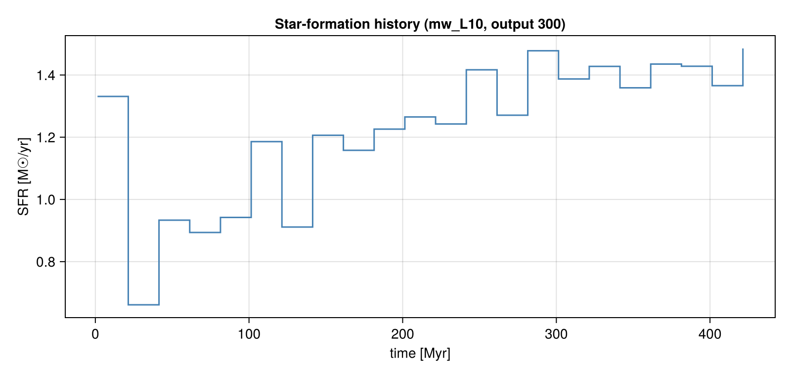

```@raw html
<!-- GENERATED FILE. Do not edit this markdown.
     Source notebook: sfr.ipynb
     Regenerate with: MERA_DIR=<repo checkout> ./render_docs.sh
     Any edit here is lost the next time the docs are rendered. -->
```

# Star-Formation Rate

!!! tip "Run it yourself"
    This page is also an executable **Jupyter notebook**: [open / download `sfr.ipynb`](https://github.com/ManuelBehrendt/Notebooks/blob/master/Mera-Docs/version_1.1/sfr.ipynb). The notebooks run end-to-end and double as part of Mera's test suite.


Mera measures star formation directly from the **star particles**, in two complementary ways:

* `sfr`, the **star-formation history** SFR(t): stellar mass formed per time bin, in M☉/yr.
* `sfr_snapshot`, the **current SFR** from a single snapshot: mass formed within recent look-back
  windows (the observational "current SFR", e.g. Hα ≈ 5 to 10 Myr, FUV ≈ 100 Myr), plus the
  lifetime-averaged rate.

Star particles are selected by the universal sentinel **`birth ≠ 0`**; the formation-time axis is
always physical (non-cosmological runs use the proper birth time, cosmological runs convert via the
Friedmann table). This notebook runs on the non-cosmological `mw_L10` disk galaxy (output 300), which
carries star particles.

> Companion to the [Star-Formation Rate](https://github.com/ManuelBehrendt/Mera.jl) doc page.

```julia
# Example-data root. Point this at your own simulation folder, or set the
# MERA_EXAMPLES environment variable; every path below is built from it.
MERA_EXAMPLES = get(ENV, "MERA_EXAMPLES", "/Volumes/FASTStorage/Simulations/Mera-Tests");

using Mera
info  = getinfo(300, joinpath(MERA_EXAMPLES, "RAMSES/mw_L10"))
parts = getparticles(info)
gas   = gethydro(info)
println("particles loaded : ", length(parts.data))
println("hydro cells      : ", length(gas.data))
```

```
*__   __ _______ ______   _______
|  |_|  |       |    _ | |   _   |
|       |    ___|   | || |  |_|  |
|       |   |___|   |_||_|       |
|       |    ___|    __  |       |
| ||_|| |   |___|   |  | |   _   |
|_|   |_|_______|___|  |_|__| |__|
Mera v1.8.0 | Julia 1.12.7 | 8 threads
[Mera]: 2026-09-09T18:40:09.061
Code: RAMSES
output [300] summary:
mtime: 2023-04-09T05:34:09
ctime: 2025-06-21T18:31:24.020
=======================================================
simulation time: 445.89 [Myr]
boxlen: 48.0 [kpc]
ncpu: 640
ndim: 3
cosmological:  false
-------------------------------------------------------
amr:           true
level(s): 6 - 10 --> cellsize(s): 750.0 [pc] - 46.88 [pc]
-------------------------------------------------------
hydro:         true
hydro-variables:  7  --> (:rho, :vx, :vy, :vz, :p, :scalar_00, :scalar_01)
hydro-descriptor: (:density, :velocity_x, :velocity_y, :velocity_z, :pressure, :scalar_00, :scalar_01)
γ: 1.6667
-------------------------------------------------------
gravity:       true
gravity-variables: (:epot, :ax, :ay, :az)
-------------------------------------------------------
particles:     true
- Nstars:   5.445150e+05
particle-variables: 7  --> (:vx, :vy, :vz, :mass, :family, :tag, :birth)
particle-descriptor: (:position_x, :position_y, :position_z, :velocity_x, :velocity_y, :velocity_z, :mass, :identity, :levelp, :family, :tag, :birth_time)
-------------------------------------------------------
rt:            false
clumps:           false
-------------------------------------------------------
namelist-file: ("&COOLING_PARAMS", "&SF_PARAMS", "&AMR_PARAMS", "&BOUNDARY_PARAMS", "&OUTPUT_PARAMS", "&POISSON_PARAMS", "&RUN_PARAMS", "&FEEDBACK_PARAMS", "&HYDRO_PARAMS", "&INIT_PARAMS", "&REFINE_PARAMS")
-------------------------------------------------------
boundaries:       not periodic (&BOUNDARY_PARAMS closes x, y, z)
timer-file:       true
compilation-file: false
makefile:         true
patchfile:        true
=======================================================
[Mera]: Get particle data: 2026-09-09T18:40:13.027
Using threaded processing with 8 threads
Key vars=(:level, :x, :y, :z, :id, :family, :tag)
Using var(s)=(1, 2, 3, 4, 7) = (:vx, :vy, :vz, :mass, :birth)
domain:
xmin::xmax: 0.0 :: 1.0  	==> 0.0 [kpc] :: 48.0 [kpc]
ymin::ymax: 0.0 :: 1.0  	==> 0.0 [kpc] :: 48.0 [kpc]
zmin::zmax: 0.0 :: 1.0  	==> 0.0 [kpc] :: 48.0 [kpc]
Processing 640 CPU files using 8 threads
Mode: Threaded processing
Combining results from 8 thread(s)...
Found 5.445150e+05 particles
Memory used for data table :38.428720474243164 MB
-------------------------------------------------------
[Mera]: Get hydro data: 2026-09-09T18:40:16.490
Key vars=(:level, :cx, :cy, :cz)
Using var(s)=(1, 2, 3, 4, 5, 6, 7) = (:rho, :vx, :vy, :vz, :p, :scalar_00, :scalar_01)
domain:
xmin::xmax: 0.0 :: 1.0  	==> 0.0 [kpc] :: 48.0 [kpc]
ymin::ymax: 0.0 :: 1.0  	==> 0.0 [kpc] :: 48.0 [kpc]
zmin::zmax: 0.0 :: 1.0  	==> 0.0 [kpc] :: 48.0 [kpc]
📊 Processing Configuration:
   Total CPU files available: 640
   Files to be processed: 640
   Compute threads: 8
   GC threads: 8
Processing files: 100%|██████████████████████████████████████████████████| Time: 0:00:18 (28.78 ms/it)
✓ File processing complete! Combining results...
✓ Data combination complete!
Final data size: 28320979 cells, 7 variables
Creating Table from 28320979 cells with max 8 threads...
  Threading: 8 threads for 11 columns
  Max threads requested: 8
  Available threads: 8
  Using parallel processing with 8 threads
  Creating IndexedTable with 11 columns...
✓ Table created in 41.563 seconds
Memory used for data table :2.321086215786636 GB
-------------------------------------------------------
particles loaded : 544515
hydro cells      : 28320979
```

## Star-formation history

`sfr(parts; tbinsize=...)` returns left bin edges `t` [Myr] and the SFR `s` [M☉/yr]. The integral of
the history recovers the total stellar mass formed: `sum(s) * tbinsize * 1e6 ≈ Σ stellar mass`.

By default `mass=:auto` prefers a stored **initial-mass** column (SFR should use the birth mass, not the
current mass reduced by post-formation mass loss). When a run stores only the current mass, as `mw_L10`
does, Mera rebuilds the birth mass from the supernova fraction the run itself recorded, and prints one
line saying so. The next section covers that.

```julia
t, s = sfr(parts; tbinsize=20.0)     # t = left bin edges [Myr], s = SFR [M☉/yr]

println("number of time bins  : ", length(t))
println("time range     [Myr] : ", (first(t), last(t)))
println("peak SFR     [M☉/yr] : ", maximum(s))
println("mean SFR     [M☉/yr] : ", sum(s)/length(s))
@show sum(s) * 20.0 * 1e6            # ≈ total stellar mass formed [M☉]
```

```
[ Info: sfr: using eta_sn=0.2 from the run's namelist to rebuild birth masses from the current :mass. Stars older than 5.0 Myr are scaled by 1/(1-eta_sn), which RAISES the rate. Pass eta_sn=0 to switch this off, or eta_sn=<value> to set it.
number of time bins  : 22
time range     [Myr] : (1.419158337486011, 421.419158337486)
peak SFR     [M☉/yr] : 1.485425
mean SFR     [M☉/yr] : 1.227753409090909
sum(s) * 20.0 * 1.0e6 = 5.402115e8
```

```
5.402115e8
```

### SN mass-loss correction

A star older than `t_sn_delay` Myr (default 5) has already returned a fraction `eta_sn` of its mass to
the gas, so the mass stored today is smaller than the mass that formed. Rescaling by `1/(1-eta_sn)`
recovers the birth mass.

RAMSES writes that fraction into its namelist and `getinfo` reads it into `info.part_info.eta_sn`, so
the default `eta_sn=:auto` uses the run's own value. Give a number to override it, or `eta_sn=0` to
integrate the current mass exactly as stored. It is ignored, with a warning, when an initial-mass
column is in use, since that is already the birth mass.

```julia
println("this run recorded eta_sn = ", info.part_info.eta_sn)

t0, s0 = sfr(parts; tbinsize=20.0, eta_sn=0)     # off: the current mass, as stored
t2, s2 = sfr(parts; tbinsize=20.0)               # default: the run's own eta_sn

println("peak SFR, correction off [M☉/yr] : ", maximum(s0))
println("peak SFR, run's eta_sn   [M☉/yr] : ", maximum(s2))
```

```
this run recorded eta_sn = 0.2
peak SFR, correction off [M☉/yr] : 1.19558
peak SFR, run's eta_sn   [M☉/yr] : 1.485425
```

## Current SFR from one snapshot

`sfr_snapshot` returns the current SFR over look-back windows (default `[5, 10, 100]` Myr) plus the
lifetime-averaged rate. For each window Δt, `SFR(Δt) = M⋆(age ≤ Δt) / Δt`.

```julia
snap = sfr_snapshot(parts)        # default windows [5, 10, 100] Myr

println("windows         [Myr] : ", snap.windows)
println("SFR per window [M☉/yr]: ", snap.sfr)
println("lifetime mean  [M☉/yr]: ", snap.sfr_mean)
println("n_stars               : ", snap.n_stars)
println("stellar mass    [M☉]  : ", snap.stellar_mass_Msol)
println("mass field used       : ", snap.mass_field)
```

```
windows         [Myr] : [5.0, 10.0, 100.0]
SFR per window [M☉/yr]: [1.3736, 1.54955, 1.417555]
lifetime mean  [M☉/yr]: 1.2292556033118338
n_stars               : 544515
stellar mass    [M☉]  : 5.463635e8
mass field used       : mass
```

```julia
# custom look-back windows
snap2 = sfr_snapshot(parts; windows=[5.0, 10.0, 50.0, 100.0])
println("custom windows  [Myr] : ", snap2.windows)
println("SFR per window [M☉/yr]: ", snap2.sfr)
```

```
custom windows  [Myr] : [5.0, 10.0, 50.0, 100.0]
SFR per window [M☉/yr]: [1.3736, 1.54955, 1.42157, 1.417555]
```

## Depletion time & star-formation efficiency

`depletion_time(gas, SFR)` combines a gas region with an SFR estimate to return the gas depletion time
`t_depl = M_gas/SFR`, the mass-weighted free-fall time `⟨t_ff⟩`, and the efficiency per free-fall time
`ε_ff = SFR·⟨t_ff⟩/M_gas` (Krumholz to McKee). Mask to the star-forming gas to measure its efficiency.

```julia
sfr_now = snap.sfr[2]                                  # current SFR from the 10 Myr window [M☉/yr]
d = depletion_time(gas, sfr_now; mask = getvar(gas, :rho, :nH) .> 27)   # dense star-forming gas

println("SFR used        [M☉/yr] : ", d.sfr)
println("M_gas (dense)   [M☉]    : ", d.M_gas_Msol)
println("depletion time  [Gyr]   : ", d.t_depl_Gyr)
println("⟨t_ff⟩ (mass-w)  [Myr]   : ", d.t_ff_mw_Myr)
println("epsilon_ff (KM)         : ", d.eps_ff)
```

```
SFR used        [M☉/yr] : 1.54955
M_gas (dense)   [M☉]    : 3.5681431847261477e8
depletion time  [Gyr]   : 0.2302696385870832
⟨t_ff⟩ (mass-w)  [Myr]   : 7.170885863082442
epsilon_ff (KM)         : 0.03114125642912564
```

The per-cell free-fall time is itself a `getvar` field `:freefall_time` (= √(3π/32Gρ)),
correct in any time unit.

```julia
tff = getvar(gas, :freefall_time, :Myr)
println("per-cell t_ff [Myr] range : ", extrema(tff))
```

```
per-cell t_ff [Myr] range : (4.434042095351683, 158141.82257929075)
```

## Plot: the star-formation history

A CairoMakie step plot of SFR(t), the standard SFH figure.

```julia
using CairoMakie

fig = Figure(size=(800, 380))
ax = Axis(fig[1,1]; xlabel="time [Myr]", ylabel="SFR [M☉/yr]",
          title="Star-formation history (mw_L10, output 300)")
stairs!(ax, t, s; step=:post, color=:steelblue)
fig
```

```
[ Info: Mera v1.8.0
```


