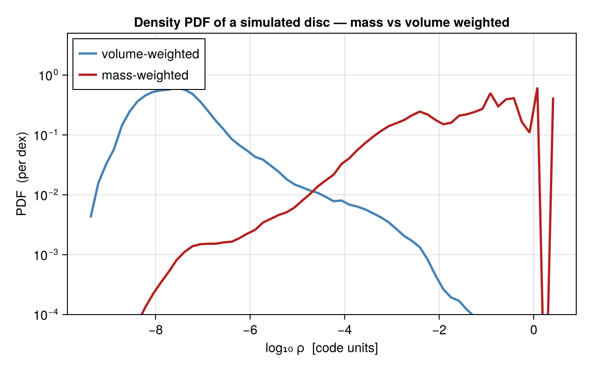

# Statistics: PDFs

[`pdf`](@ref) computes the **probability distribution function** of any [`getvar`](@ref)
quantity over the cells (or particles) of a snapshot. The canonical use is the **density
PDF** — the log-normal core (with a power-law high-density tail) that supersonic turbulence
and self-gravity imprint on the gas, and the starting point for many star-formation models.



```julia
using Mera
gas = gethydro(getinfo(100, "/data/Mera-Tests/spiral_clumps"))

P  = pdf(gas, :rho)                    # mass-weighted density PDF
Pv = pdf(gas, :rho; weight=:volume)    # volume-weighted

# plot, e.g.
# lines(log10.(P.centers), P.pdf)
```

## What it returns

`pdf` returns a `NamedTuple` `(centers, edges, pdf, logbins, quantity, unit, weight)`:

- `centers` / `edges` — bin centres / edges, in the quantity's units.
- `pdf` — a probability **density** on the binning axis. With `logbins=true` (the default)
  the axis is `log10(quantity)`, so `pdf` is a density **per dex**; with `logbins=false` it
  is a density per unit. Either way it is normalised to unit area:

  ```julia
  sum(P.pdf .* diff(log10.(P.edges))) ≈ 1     # logbins
  sum(P.pdf .* diff(P.edges)) ≈ 1             # linear bins
  ```

## Weighting

The weight decides *what* the PDF describes — and the two weightings tell different stories
(as in the figure):

- `weight=:mass` (default) — "how much **mass** is at each density"; peaks at high density.
- `weight=:volume` — "how much **volume** is at each density"; the volume-weighted density
  PDF is the one compared with turbulence theory (the log-normal).
- `weight=:cells` / `:count` — number-weighted (every cell counts equally).

## Options

| keyword | default | meaning |
|---------|---------|---------|
| `weight` | `:mass` | `:mass`, `:volume`, or `:cells`/`:count` |
| `norm` | `:density` | `:density` (area = 1), `:probability` (Σ = 1), `:peak` (max = 1), or `:count`/`:none` (raw weighted counts) |
| `logbins` | `true` | log-spaced bins over `log10(quantity)` (quantity must be > 0) |
| `bins` | `60` | number of bins |
| `valrange` | data range | `(min, max)` of the quantity |
| `unit` | `:standard` | unit of `quantity` |
| `mask` | `[false]` | restrict to selected cells/particles |

The `norm` choices answer different questions: `:density` is the proper (bin-width-independent)
PDF for comparing against theory or different binnings; `:probability` gives the mass/volume
fraction in each bin; `:peak` compares **shapes** regardless of amplitude; `:count` keeps the
raw weighted histogram.

It works on any quantity, not just density — e.g. `pdf(gas, :T)` (temperature), `pdf(gas,
:mach)` (Mach number), `pdf(gas, :p)` (pressure). Combine with [`subregion`](@ref) or a
`mask` to restrict to a region, and with [`timeseries`](@ref) to watch a PDF evolve.

!!! note "Name clash"
    `pdf` is also exported by `Distributions.jl`; if you `using` both packages, call
    `Mera.pdf`.

## Planned

Density/velocity **power spectra** and **structure functions** are planned as a follow-up;
they need an FFT backend and will ship as a package extension (`using FFTW`), the same way
[`savefits`](@ref) uses FITSIO. Many derived quantities are already available through
[`getvar`](@ref) — e.g. `:freefall_time`, `:jeanslength`/`:jeansmass`,
`:virial_parameter_local`, the sound speed `:cs`, and the Mach numbers `:mach*`.

## See also

- [`getvar`](@ref) — the quantities you can take a PDF of (and the derived timescales).
- [`profile`](@ref) — radial/quantity *profiles* (means in bins), the complementary view.
- [`timeseries`](@ref) — evolve a PDF across snapshots.
