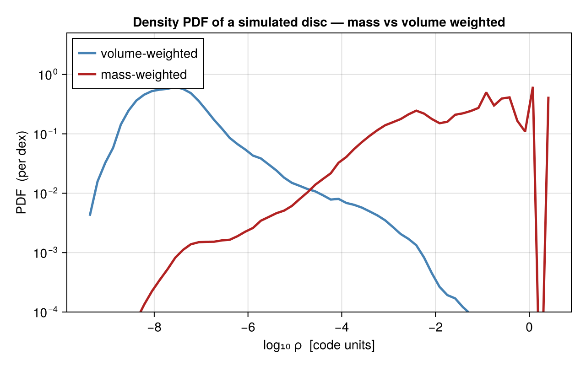

```@raw html
<!-- GENERATED FILE. Do not edit this markdown.
     Source notebook: statistics.ipynb
     Regenerate with: MERA_DIR=<repo checkout> ./render_docs.sh
     Any edit here is lost the next time the docs are rendered. -->
```

# Statistics: PDFs

!!! tip "Run it yourself"
    This page is also an executable **Jupyter notebook** — [open / download `statistics.ipynb`](https://github.com/ManuelBehrendt/Notebooks/blob/master/Mera-Docs/version_1.1/statistics.ipynb). The notebooks run end-to-end and double as part of Mera's test suite.


[`pdf`](@ref) computes the **probability distribution function** of any [`getvar`](@ref)
quantity over the cells (or particles) of a snapshot. The canonical use is the **density
PDF** — the log-normal core (with a power-law high-density tail) that supersonic turbulence
and self-gravity imprint on the gas, and the starting point for many star-formation models.



```julia
# Example-data root. Point this at your own simulation folder, or set the
# MERA_EXAMPLES environment variable; every path below is built from it.
MERA_EXAMPLES = get(ENV, "MERA_EXAMPLES", "/Volumes/FASTStorage/Simulations/Mera-Tests");

using Mera
info = getinfo(300, joinpath(MERA_EXAMPLES, "RAMSES/mw_L10"))
gas  = gethydro(info, verbose=false);
```

```
*__   __ _______ ______   _______
|  |_|  |       |    _ | |   _   |
|       |    ___|   | || |  |_|  |
|       |   |___|   |_||_|       |
|       |    ___|    __  |       |
| ||_|| |   |___|   |  | |   _   |
|_|   |_|_______|___|  |_|__| |__|
Mera v1.8.0
[Mera]: 2026-08-03T12:20:55.608
Code: RAMSES
output [300] summary:
mtime: 2023-04-09T05:34:09
ctime: 2025-06-21T18:31:24.020
=======================================================
simulation time: 445.89 [Myr]
boxlen: 48.0 [kpc]
ncpu: 640
ndim: 3
cosmological:  false
-------------------------------------------------------
amr:           true
level(s): 6 - 10 --> cellsize(s): 750.0 [pc] - 46.88 [pc]
-------------------------------------------------------
hydro:         true
hydro-variables:  7  --> (:rho, :vx, :vy, :vz, :p, :scalar_00, :scalar_01)
hydro-descriptor: (:density, :velocity_x, :velocity_y, :velocity_z, :pressure, :scalar_00, :scalar_01)
γ: 1.6667
-------------------------------------------------------
gravity:       true
gravity-variables: (:epot, :ax, :ay, :az)
-------------------------------------------------------
particles:     true
- Nstars:   5.445150e+05
particle-variables: 7  --> (:vx, :vy, :vz, :mass, :family, :tag, :birth)
particle-descriptor: (:position_x, :position_y, :position_z, :velocity_x, :velocity_y, :velocity_z, :mass, :identity, :levelp, :family, :tag, :birth_time)
-------------------------------------------------------
rt:            false
clumps:           false
-------------------------------------------------------
namelist-file: ("&COOLING_PARAMS", "&SF_PARAMS", "&AMR_PARAMS", "&BOUNDARY_PARAMS", "&OUTPUT_PARAMS", "&POISSON_PARAMS", "&RUN_PARAMS", "&FEEDBACK_PARAMS", "&HYDRO_PARAMS", "&INIT_PARAMS", "&REFINE_PARAMS")
-------------------------------------------------------
timer-file:       true
compilation-file: false
makefile:         true
patchfile:        true
=======================================================
Processing files: 100%|██████████████████████████████████████████████████| Time: 0:00:18 (28.67 ms/it)
✓ File processing complete! Combining results...
```

```julia
P  = pdf(gas, :rho)                    # mass-weighted (default)
Pv = pdf(gas, :rho; weight=:volume)   # volume-weighted
println("nbins                 : ", length(P.pdf))
println("sum P dln(rho) (logbins) ≈ 1 : ", sum(P.pdf .* diff(log10.(P.edges))))
println("rho range             : ", extrema(P.centers))
```

```
nbins                 : 60
sum P dln(rho) (logbins) ≈ 1 : 0.9999999999999999
rho range             : (3.117453040888466e-9, 2.7960968598850635)
```

## What it returns

`pdf` returns a `NamedTuple` `(centers, edges, pdf, logbins, quantity, unit, weight)`:

- `centers` / `edges` — bin centres / edges, in the quantity's units.
- `pdf` — a probability **density** on the binning axis. With `logbins=true` (the default)
  the axis is `log10(quantity)`, so `pdf` is a density **per dex**; with `logbins=false` it
  is a density per unit. Either way it is normalised to unit area:

  ```julia
  sum(P.pdf .* diff(log10.(P.edges))) ≈ 1     # logbins
  sum(P.pdf .* diff(P.edges)) ≈ 1             # linear bins
  ```

## Weighting

The weight decides *what* the PDF describes — and the two weightings tell different stories
(as in the figure):

- `weight=:mass` (default) — "how much **mass** is at each density"; peaks at high density.
- `weight=:volume` — "how much **volume** is at each density"; the volume-weighted density
  PDF is the one compared with turbulence theory (the log-normal).
- `weight=:cells` / `:count` — number-weighted (every cell counts equally).

## Options

| keyword | default | meaning |
|---------|---------|---------|
| `weight` | `:mass` | `:mass`, `:volume`, or `:cells`/`:count` |
| `norm` | `:density` | `:density` (area = 1), `:probability` (Σ = 1), `:peak` (max = 1), or `:count`/`:none` (raw weighted counts) |
| `logbins` | `true` | log-spaced bins over `log10(quantity)` (quantity must be > 0) |
| `bins` | `60` | number of bins |
| `valrange` | data range | `(min, max)` of the quantity |
| `unit` | `:standard` | unit of `quantity` |
| `mask` | `[false]` | restrict to selected cells/particles |

The `norm` choices answer different questions: `:density` is the proper (bin-width-independent)
PDF for comparing against theory or different binnings; `:probability` gives the mass/volume
fraction in each bin; `:peak` compares **shapes** regardless of amplitude; `:count` keeps the
raw weighted histogram.

It works on any quantity, not just density — e.g. `pdf(gas, :T)` (temperature), `pdf(gas,
:mach)` (Mach number), `pdf(gas, :p)` (pressure). Combine with [`subregion`](@ref) or a
`mask` to restrict to a region, and with [`timeseries`](@ref) to watch a PDF evolve.

## Any data type — and projected 2D maps

`pdf` is generic over the data object, so it works on **hydro, particle, gravity, and RT**
data — any quantity/weight [`getvar`](@ref) supports. For a **signed** field (the potential
`:epot`, a velocity component) pass `logbins=false`, since log bins need positive values.

Pass a [`projection`](@ref) result and `pdf` takes the **PDF of the 2D map's pixels** — with
`:sd` this is the **column-density PDF (N-PDF)**, a standard observational diagnostic. Weight
by `:area` (default, every pixel equal), `:value`, or another map key; a raw matrix works too
(`pdf(p.maps[:sd])`):

```julia
parts = getparticles(info, verbose=false)
Pp = pdf(parts, :vx; weight=:mass, logbins=false)        # particle velocity PDF
println("particle vx PDF bins  : ", length(Pp.pdf))

grav = getgravity(info, verbose=false)
Pe = pdf(grav, :epot; weight=:volume, logbins=false)     # potential PDF
println("epot PDF bins         : ", length(Pe.pdf))

p = projection(gas, :sd; verbose=false)
N = pdf(p, :sd)                                          # area-weighted N-PDF of the map
println("map N-PDF bins        : ", length(N.pdf))
```

```
particle vx PDF bins  : 60
Processing files: 100%|██████████████████████████████████████████████████| Time: 0:00:13 (21.32 ms/it)
✓ File processing complete! Combining results...
epot PDF bins         : 60
Progress: 100%|█████████████████████████████████████████| Time: 0:00:01
map N-PDF bins        : 60
```

!!! note "Name clash"
    `pdf` is also exported by `Distributions.jl`; if you `using` both packages, call
    `Mera.pdf`.

## Plot the density PDF

```julia
using CairoMakie
fig = Figure(size=(560,400))
ax = Axis(fig[1,1], title="density PDF (mw_L10)", xlabel="log10 rho", ylabel="PDF")
lines!(ax, log10.(P.centers), P.pdf, label="mass-weighted")
lines!(ax, log10.(Pv.centers), Pv.pdf, label="volume-weighted")
axislegend(ax); fig
```


## Planned

Density/velocity **power spectra** and **structure functions** are planned as a follow-up;
they need an FFT backend and will ship as a package extension (`using FFTW`), the same way
a FITS exporter uses FITSIO. Many derived quantities are already available through
[`getvar`](@ref) — e.g. `:freefall_time`, `:jeanslength`/`:jeansmass`,
`:virial_parameter_local`, the sound speed `:cs`, and the Mach numbers `:mach*`.

## See also

- [`getvar`](@ref) — the quantities you can take a PDF of (and the derived timescales).
- [`profile`](@ref) — radial/quantity *profiles* (means in bins), the complementary view.
- [`timeseries`](@ref) — evolve a PDF across snapshots.
