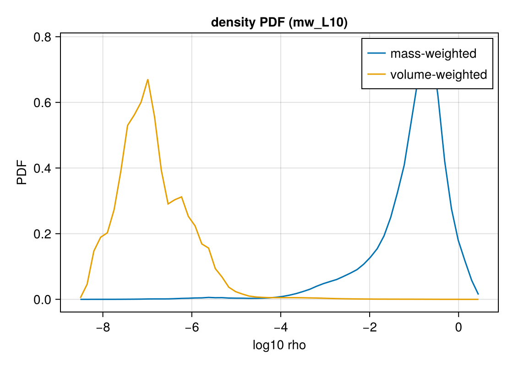

# Statistics: PDFs

!!! tip "Run it yourself"
    This page is also an executable **Jupyter notebook** — [open / download `statistics.ipynb`](https://github.com/ManuelBehrendt/Notebooks/blob/master/Mera-Docs/version_1.1/statistics.ipynb). The notebooks run end-to-end and double as part of Mera's test suite.

[`pdf`](@ref) computes the **probability distribution function** of any [`getvar`](@ref)
quantity over the cells (or particles) of a snapshot. The canonical use is the **density
PDF** — the log-normal core (with a power-law high-density tail) that supersonic turbulence
and self-gravity imprint on the gas, and the starting point for many star-formation models.


```julia
using Mera
base = get(ENV, "MERA_TEST_DATA", "/Volumes/FASTStorage/Simulations/Mera-Tests")
info = getinfo(300, joinpath(base, "RAMSES/mw_L10"))
gas  = gethydro(info, verbose=false);
```


```
*__   __ _______ ______   _______ 
```


```
|  |_|  |       |    _ | |   _   |
|       |    ___|   | || |  |_|  |
|       |   |___|   |_||_|       |
|       |    ___|    __  |       |
| ||_|| |   |___|   |  | |   _   |
|_|   |_|_______|___|  |_|__| |__|
Mera v1.8.0
```


```
[Mera]: 2026-07-31T21:44:34.750
```


```
Code: RAMSES
```


```
output [300] summary:
mtime: 2023-04-09T05:34:09
ctime: 2025-06-21T18:31:24.020
=======================================================
simulation time: 445.89 [Myr]
boxlen: 48.0 [kpc]
ncpu: 640
ndim: 3
cosmological:  false
-------------------------------------------------------
amr:           true
level(s): 6 - 10 --> cellsize(s): 750.0 [pc] - 46.88 [pc]
-------------------------------------------------------
hydro:         true
hydro-variables:  
```


```
7  --> (:rho, :vx, :vy, :vz, :p, :scalar_00, :scalar_01)
hydro-descriptor: (:density, :velocity_x, :velocity_y, :velocity_z, :pressure, :scalar_00, :scalar_01)
γ: 1.6667
-------------------------------------------------------
gravity:       true
gravity-variables: (:epot, :ax, :ay, :az)
-------------------------------------------------------
particles:     true
- Nstars:   5.445150e+05 
particle-variables: 
```


```
7  --> (:vx, :vy, :vz, :mass, :family, :tag, :birth)
particle-descriptor: (:position_x, :position_y, :position_z, :velocity_x, :velocity_y, :velocity_z, :mass, :identity, :levelp, :family, :tag, :birth_time)
-------------------------------------------------------
rt:            false
clumps:           false
-------------------------------------------------------
namelist-file: 
```


```
("&COOLING_PARAMS", "&SF_PARAMS", "&AMR_PARAMS", "&BOUNDARY_PARAMS", "&OUTPUT_PARAMS", "&POISSON_PARAMS", "&RUN_PARAMS", "&FEEDBACK_PARAMS", "&HYDRO_PARAMS", "&INIT_PARAMS", "&REFINE_PARAMS")
-------------------------------------------------------
timer-file:       true
compilation-file: false
makefile:         true
patchfile:        true
=======================================================
```


Processing files:   0%|                                                  |  ETA: N/A (  N/A  s/it)


Processing files:   2%|▊                                                 |  ETA: 0:01:06 ( 0.11  s/it)


Processing files:   3%|█▍                                                |  ETA: 0:00:49 (77.97 ms/it)


Processing files:   4%|█▊                                                |  ETA: 0:00:42 (67.39 ms/it)


Processing files:   4%|██▎                                               |  ETA: 0:00:38 (61.76 ms/it)


Processing files:   5%|██▍                                               |  ETA: 0:00:38 (61.69 ms/it)


Processing files:   6%|███▏                                              |  ETA: 0:00:33 (55.56 ms/it)


Processing files:   7%|███▋                                              |  ETA: 0:00:30 (51.18 ms/it)


Processing files:   8%|████                                              |  ETA: 0:00:28 (48.14 ms/it)


Processing files:   9%|████▍                                             |  ETA: 0:00:27 (46.03 ms/it)


Processing files:  10%|████▊                                             |  ETA: 0:00:25 (44.02 ms/it)


Processing files:  10%|█████▏                                            |  ETA: 0:00:25 (42.70 ms/it)


Processing files:  11%|█████▌                                            |  ETA: 0:00:24 (42.48 ms/it)


Processing files:  12%|██████                                            |  ETA: 0:00:23 (40.42 ms/it)


Processing files:  13%|██████▍                                           |  ETA: 0:00:22 (39.56 ms/it)


Processing files:  14%|███████                                           |  ETA: 0:00:21 (38.50 ms/it)


Processing files:  15%|███████▊                                          |  ETA: 0:00:20 (37.30 ms/it)


Processing files:  16%|████████▏                                         |  ETA: 0:00:20 (36.56 ms/it)


Processing files:  17%|████████▌                                         |  ETA: 0:00:19 (36.01 ms/it)


Processing files:  18%|████████▉                                         |  ETA: 0:00:19 (35.78 ms/it)


Processing files:  19%|█████████▎                                        |  ETA: 0:00:18 (35.19 ms/it)


Processing files:  19%|█████████▋                                        |  ETA: 0:00:18 (35.06 ms/it)


Processing files:  20%|██████████▏                                       |  ETA: 0:00:18 (34.55 ms/it)


Processing files:  22%|███████████▎                                      |  ETA: 0:00:16 (32.70 ms/it)


Processing files:  23%|███████████▊                                      |  ETA: 0:00:16 (32.31 ms/it)


Processing files:  25%|████████████▎                                     |  ETA: 0:00:15 (31.84 ms/it)


Processing files:  26%|████████████▊                                     |  ETA: 0:00:15 (31.10 ms/it)


Processing files:  27%|█████████████▎                                    |  ETA: 0:00:15 (31.10 ms/it)


Processing files:  28%|█████████████▊                                    |  ETA: 0:00:14 (30.78 ms/it)


Processing files:  29%|██████████████▍                                   |  ETA: 0:00:14 (30.32 ms/it)


Processing files:  30%|██████████████▉                                   |  ETA: 0:00:13 (29.81 ms/it)


Processing files:  31%|███████████████▎                                  |  ETA: 0:00:13 (29.79 ms/it)


Processing files:  32%|████████████████                                  |  ETA: 0:00:13 (29.38 ms/it)


Processing files:  33%|████████████████▌                                 |  ETA: 0:00:13 (29.28 ms/it)


Processing files:  36%|█████████████████▉                                |  ETA: 0:00:12 (29.05 ms/it)


Processing files:  36%|██████████████████▎                               |  ETA: 0:00:12 (28.99 ms/it)


Processing files:  37%|██████████████████▌                               |  ETA: 0:00:12 (28.95 ms/it)


Processing files:  38%|██████████████████▉                               |  ETA: 0:00:12 (28.99 ms/it)


Processing files:  38%|███████████████████▎                              |  ETA: 0:00:11 (28.90 ms/it)


Processing files:  39%|███████████████████▌                              |  ETA: 0:00:11 (28.92 ms/it)


Processing files:  40%|████████████████████                              |  ETA: 0:00:11 (28.82 ms/it)


Processing files:  41%|████████████████████▎                             |  ETA: 0:00:11 (29.02 ms/it)


Processing files:  42%|█████████████████████                             |  ETA: 0:00:11 (28.94 ms/it)


Processing files:  42%|█████████████████████▎                            |  ETA: 0:00:11 (28.93 ms/it)


Processing files:  43%|█████████████████████▌                            |  ETA: 0:00:11 (28.89 ms/it)


Processing files:  44%|█████████████████████▉                            |  ETA: 0:00:10 (29.06 ms/it)


Processing files:  44%|██████████████████████▎                           |  ETA: 0:00:10 (29.21 ms/it)


Processing files:  45%|██████████████████████▌                           |  ETA: 0:00:10 (29.16 ms/it)


Processing files:  46%|██████████████████████▊                           |  ETA: 0:00:10 (29.30 ms/it)


Processing files:  46%|███████████████████████▏                          |  ETA: 0:00:10 (29.50 ms/it)


Processing files:  47%|███████████████████████▍                          |  ETA: 0:00:10 (29.57 ms/it)


Processing files:  47%|███████████████████████▌                          |  ETA: 0:00:10 (29.93 ms/it)


Processing files:  48%|████████████████████████▏                         |  ETA: 0:00:10 (30.08 ms/it)


Processing files:  49%|████████████████████████▌                         |  ETA: 0:00:10 (30.14 ms/it)


Processing files:  49%|████████████████████████▊                         |  ETA: 0:00:10 (30.38 ms/it)


Processing files:  51%|█████████████████████████▌                        |  ETA: 0:00:10 (30.47 ms/it)


Processing files:  51%|█████████████████████████▊                        |  ETA: 0:00:10 (30.61 ms/it)


Processing files:  52%|█████████████████████████▉                        |  ETA: 0:00:10 (30.76 ms/it)


Processing files:  54%|██████████████████████████▉                       |  ETA: 0:00:09 (31.32 ms/it)


Processing files:  55%|███████████████████████████▎                      |  ETA: 0:00:09 (31.25 ms/it)


Processing files:  55%|███████████████████████████▌                      |  ETA: 0:00:09 (31.36 ms/it)


Processing files:  56%|███████████████████████████▊                      |  ETA: 0:00:09 (31.31 ms/it)


Processing files:  56%|████████████████████████████▏                     |  ETA: 0:00:09 (31.44 ms/it)


Processing files:  58%|████████████████████████████▊                     |  ETA: 0:00:09 (31.27 ms/it)


Processing files:  58%|█████████████████████████████                     |  ETA: 0:00:08 (31.22 ms/it)


Processing files:  59%|█████████████████████████████▍                    |  ETA: 0:00:08 (31.29 ms/it)


Processing files:  59%|█████████████████████████████▊                    |  ETA: 0:00:08 (31.27 ms/it)


Processing files:  60%|██████████████████████████████▏                   |  ETA: 0:00:08 (31.13 ms/it)


Processing files:  61%|██████████████████████████████▌                   |  ETA: 0:00:08 (31.04 ms/it)


Processing files:  62%|██████████████████████████████▉                   |  ETA: 0:00:08 (31.01 ms/it)


Processing files:  62%|███████████████████████████████▏                  |  ETA: 0:00:07 (30.97 ms/it)


Processing files:  63%|███████████████████████████████▌                  |  ETA: 0:00:07 (30.85 ms/it)


Processing files:  64%|███████████████████████████████▉                  |  ETA: 0:00:07 (30.85 ms/it)


Processing files:  65%|████████████████████████████████▌                 |  ETA: 0:00:07 (30.64 ms/it)


Processing files:  66%|████████████████████████████████▉                 |  ETA: 0:00:07 (30.69 ms/it)


Processing files:  67%|█████████████████████████████████▎                |  ETA: 0:00:07 (30.69 ms/it)


Processing files:  68%|█████████████████████████████████▊                |  ETA: 0:00:06 (30.56 ms/it)


Processing files:  69%|██████████████████████████████████▎               |  ETA: 0:00:06 (30.35 ms/it)


Processing files:  70%|██████████████████████████████████▊               |  ETA: 0:00:06 (30.35 ms/it)


Processing files:  70%|███████████████████████████████████▏              |  ETA: 0:00:06 (30.31 ms/it)


Processing files:  71%|███████████████████████████████████▊              |  ETA: 0:00:06 (30.08 ms/it)


Processing files:  72%|████████████████████████████████████▏             |  ETA: 0:00:05 (30.04 ms/it)


Processing files:  73%|████████████████████████████████████▊             |  ETA: 0:00:05 (29.85 ms/it)


Processing files:  75%|█████████████████████████████████████▍            |  ETA: 0:00:05 (29.73 ms/it)


Processing files:  76%|█████████████████████████████████████▊            |  ETA: 0:00:05 (29.64 ms/it)


Processing files:  77%|██████████████████████████████████████▍           |  ETA: 0:00:04 (29.50 ms/it)


Processing files:  78%|██████████████████████████████████████▊           |  ETA: 0:00:04 (29.47 ms/it)


Processing files:  78%|███████████████████████████████████████▏          |  ETA: 0:00:04 (29.41 ms/it)


Processing files:  80%|███████████████████████████████████████▊          |  ETA: 0:00:04 (29.22 ms/it)


Processing files:  80%|████████████████████████████████████████▎         |  ETA: 0:00:04 (29.08 ms/it)


Processing files:  81%|████████████████████████████████████████▊         |  ETA: 0:00:03 (29.07 ms/it)


Processing files:  82%|█████████████████████████████████████████▏        |  ETA: 0:00:03 (28.99 ms/it)


Processing files:  83%|█████████████████████████████████████████▌        |  ETA: 0:00:03 (28.96 ms/it)


Processing files:  84%|██████████████████████████████████████████        |  ETA: 0:00:03 (28.83 ms/it)


Processing files:  85%|██████████████████████████████████████████▍       |  ETA: 0:00:03 (28.76 ms/it)


Processing files:  85%|██████████████████████████████████████████▊       |  ETA: 0:00:03 (28.75 ms/it)


Processing files:  86%|███████████████████████████████████████████▎      |  ETA: 0:00:02 (28.62 ms/it)


Processing files:  87%|███████████████████████████████████████████▋      |  ETA: 0:00:02 (28.57 ms/it)


Processing files:  88%|████████████████████████████████████████████      |  ETA: 0:00:02 (28.53 ms/it)


Processing files:  89%|████████████████████████████████████████████▎     |  ETA: 0:00:02 (28.52 ms/it)


Processing files:  89%|████████████████████████████████████████████▋     |  ETA: 0:00:02 (28.51 ms/it)


Processing files:  90%|████████████████████████████████████████████▉     |  ETA: 0:00:02 (28.61 ms/it)


Processing files:  93%|██████████████████████████████████████████████▌   |  ETA: 0:00:01 (28.35 ms/it)


Processing files:  94%|██████████████████████████████████████████████▉   |  ETA: 0:00:01 (28.33 ms/it)


Processing files:  94%|███████████████████████████████████████████████▎  |  ETA: 0:00:01 (28.36 ms/it)


Processing files:  95%|███████████████████████████████████████████████▌  |  ETA: 0:00:01 (28.36 ms/it)


Processing files:  96%|███████████████████████████████████████████████▊  |  ETA: 0:00:01 (28.38 ms/it)


Processing files:  96%|████████████████████████████████████████████████▎ |  ETA: 0:00:01 (28.43 ms/it)


Processing files:  97%|████████████████████████████████████████████████▌ |  ETA: 0:00:01 (28.48 ms/it)


Processing files:  98%|████████████████████████████████████████████████▊ |  ETA: 0:00:00 (28.47 ms/it)


Processing files:  98%|█████████████████████████████████████████████████ |  ETA: 0:00:00 (28.51 ms/it)


Processing files:  99%|█████████████████████████████████████████████████▎|  ETA: 0:00:00 (28.68 ms/it)


Processing files:  99%|█████████████████████████████████████████████████▋|  ETA: 0:00:00 (28.69 ms/it)


Processing files:  99%|█████████████████████████████████████████████████▉|  ETA: 0:00:00 (28.77 ms/it)


Processing files: 100%|██████████████████████████████████████████████████| Time: 0:00:18 (28.71 ms/it)


```
✓ File processing complete! Combining results...
```


```julia
P  = pdf(gas, :rho)                    # mass-weighted (default)
Pv = pdf(gas, :rho; weight=:volume)   # volume-weighted
println("nbins                 : ", length(P.pdf))
println("sum P dln(rho) (logbins) ≈ 1 : ", sum(P.pdf .* diff(log10.(P.edges))))
println("rho range             : ", extrema(P.centers))
```

```
nbins                 : 60
```


```
sum P dln(rho) (logbins) ≈ 1 : 0.9999999999999999
rho range             : (3.117453040888466e-9, 2.7960968598850635)
```


## What it returns

`pdf` returns a `NamedTuple` `(centers, edges, pdf, logbins, quantity, unit, weight)`:

- `centers` / `edges` — bin centres / edges, in the quantity's units.
- `pdf` — a probability **density** on the binning axis. With `logbins=true` (the default)
  the axis is `log10(quantity)`, so `pdf` is a density **per dex**; with `logbins=false` it
  is a density per unit. Either way it is normalised to unit area:

  ```julia
  sum(P.pdf .* diff(log10.(P.edges))) ≈ 1     # logbins
  sum(P.pdf .* diff(P.edges)) ≈ 1             # linear bins
  ```

## Weighting

The weight decides *what* the PDF describes — and the two weightings tell different stories
(as in the figure):

- `weight=:mass` (default) — "how much **mass** is at each density"; peaks at high density.
- `weight=:volume` — "how much **volume** is at each density"; the volume-weighted density
  PDF is the one compared with turbulence theory (the log-normal).
- `weight=:cells` / `:count` — number-weighted (every cell counts equally).

## Options

| keyword | default | meaning |
|---------|---------|---------|
| `weight` | `:mass` | `:mass`, `:volume`, or `:cells`/`:count` |
| `norm` | `:density` | `:density` (area = 1), `:probability` (Σ = 1), `:peak` (max = 1), or `:count`/`:none` (raw weighted counts) |
| `logbins` | `true` | log-spaced bins over `log10(quantity)` (quantity must be > 0) |
| `bins` | `60` | number of bins |
| `valrange` | data range | `(min, max)` of the quantity |
| `unit` | `:standard` | unit of `quantity` |
| `mask` | `[false]` | restrict to selected cells/particles |

The `norm` choices answer different questions: `:density` is the proper (bin-width-independent)
PDF for comparing against theory or different binnings; `:probability` gives the mass/volume
fraction in each bin; `:peak` compares **shapes** regardless of amplitude; `:count` keeps the
raw weighted histogram.

It works on any quantity, not just density — e.g. `pdf(gas, :T)` (temperature), `pdf(gas,
:mach)` (Mach number), `pdf(gas, :p)` (pressure). Combine with [`subregion`](@ref) or a
`mask` to restrict to a region, and with [`timeseries`](@ref) to watch a PDF evolve.

## Any data type — and projected 2D maps

`pdf` is generic over the data object, so it works on **hydro, particle, gravity, and RT**
data — any quantity/weight [`getvar`](@ref) supports. For a **signed** field (the potential
`:epot`, a velocity component) pass `logbins=false`, since log bins need positive values.

Pass a [`projection`](@ref) result and `pdf` takes the **PDF of the 2D map's pixels** — with
`:sd` this is the **column-density PDF (N-PDF)**, a standard observational diagnostic. Weight
by `:area` (default, every pixel equal), `:value`, or another map key; a raw matrix works too
(`pdf(p.maps[:sd])`):

```julia
parts = getparticles(info, verbose=false)
Pp = pdf(parts, :vx; weight=:mass, logbins=false)        # particle velocity PDF
println("particle vx PDF bins  : ", length(Pp.pdf))

grav = getgravity(info, verbose=false)
Pe = pdf(grav, :epot; weight=:volume, logbins=false)     # potential PDF
println("epot PDF bins         : ", length(Pe.pdf))

p = projection(gas, :sd; verbose=false)
N = pdf(p, :sd)                                          # area-weighted N-PDF of the map
println("map N-PDF bins        : ", length(N.pdf))
```

```
particle vx PDF bins  : 60
```


Processing files:   0%|                                                  |  ETA: N/A (  N/A  s/it)


Processing files:   1%|▍                                                 |  ETA: 0:00:42 (66.64 ms/it)


Processing files:   2%|▊                                                 |  ETA: 0:00:31 (49.73 ms/it)


Processing files:   4%|█▊                                                |  ETA: 0:00:21 (34.07 ms/it)


Processing files:   4%|██▎                                               |  ETA: 0:00:20 (32.47 ms/it)


Processing files:   5%|██▋                                               |  ETA: 0:00:19 (31.11 ms/it)


Processing files:   6%|███                                               |  ETA: 0:00:18 (29.37 ms/it)


Processing files:   7%|███▋                                              |  ETA: 0:00:16 (27.33 ms/it)


Processing files:   8%|████                                              |  ETA: 0:00:15 (26.19 ms/it)


Processing files:   9%|████▌                                             |  ETA: 0:00:15 (25.43 ms/it)


Processing files:  10%|█████▏                                            |  ETA: 0:00:14 (24.29 ms/it)


Processing files:  12%|█████▊                                            |  ETA: 0:00:13 (23.48 ms/it)


Processing files:  12%|██████▎                                           |  ETA: 0:00:13 (23.04 ms/it)


Processing files:  13%|██████▊                                           |  ETA: 0:00:13 (22.67 ms/it)


Processing files:  15%|███████▍                                          |  ETA: 0:00:12 (21.84 ms/it)


Processing files:  16%|████████                                          |  ETA: 0:00:12 (21.63 ms/it)


Processing files:  17%|████████▍                                         |  ETA: 0:00:12 (21.98 ms/it)


Processing files:  18%|████████▉                                         |  ETA: 0:00:11 (21.76 ms/it)


Processing files:  19%|█████████▍                                        |  ETA: 0:00:11 (21.52 ms/it)


Processing files:  20%|█████████▉                                        |  ETA: 0:00:11 (21.21 ms/it)


Processing files:  21%|██████████▌                                       |  ETA: 0:00:11 (20.98 ms/it)


Processing files:  23%|███████████▍                                      |  ETA: 0:00:10 (20.39 ms/it)


Processing files:  24%|████████████                                      |  ETA: 0:00:10 (20.06 ms/it)


Processing files:  25%|████████████▌                                     |  ETA: 0:00:10 (19.86 ms/it)


Processing files:  26%|█████████████                                     |  ETA: 0:00:09 (19.69 ms/it)


Processing files:  28%|█████████████▊                                    |  ETA: 0:00:09 (19.39 ms/it)


Processing files:  29%|██████████████▎                                   |  ETA: 0:00:09 (19.23 ms/it)


Processing files:  30%|██████████████▉                                   |  ETA: 0:00:09 (19.11 ms/it)


Processing files:  31%|███████████████▌                                  |  ETA: 0:00:08 (19.01 ms/it)


Processing files:  32%|████████████████▎                                 |  ETA: 0:00:08 (18.79 ms/it)


Processing files:  34%|████████████████▊                                 |  ETA: 0:00:08 (18.83 ms/it)


Processing files:  35%|█████████████████▍                                |  ETA: 0:00:08 (18.87 ms/it)


Processing files:  36%|██████████████████                                |  ETA: 0:00:08 (18.81 ms/it)


Processing files:  37%|██████████████████▌                               |  ETA: 0:00:08 (18.70 ms/it)


Processing files:  38%|███████████████████                               |  ETA: 0:00:07 (18.75 ms/it)


Processing files:  39%|███████████████████▌                              |  ETA: 0:00:07 (18.71 ms/it)


Processing files:  40%|███████████████████▉                              |  ETA: 0:00:07 (18.76 ms/it)


Processing files:  41%|████████████████████▍                             |  ETA: 0:00:07 (18.86 ms/it)


Processing files:  42%|████████████████████▉                             |  ETA: 0:00:07 (18.85 ms/it)


Processing files:  42%|█████████████████████▎                            |  ETA: 0:00:07 (18.90 ms/it)


Processing files:  43%|█████████████████████▋                            |  ETA: 0:00:07 (19.05 ms/it)


Processing files:  44%|██████████████████████▎                           |  ETA: 0:00:07 (19.24 ms/it)


Processing files:  45%|██████████████████████▋                           |  ETA: 0:00:07 (19.52 ms/it)


Processing files:  47%|███████████████████████▌                          |  ETA: 0:00:07 (19.73 ms/it)


Processing files:  48%|███████████████████████▊                          |  ETA: 0:00:07 (19.86 ms/it)


Processing files:  48%|████████████████████████                          |  ETA: 0:00:07 (19.97 ms/it)


Processing files:  49%|████████████████████████▍                         |  ETA: 0:00:07 (20.07 ms/it)


Processing files:  50%|████████████████████████▊                         |  ETA: 0:00:07 (20.24 ms/it)


Processing files:  50%|█████████████████████████▏                        |  ETA: 0:00:06 (20.28 ms/it)


Processing files:  51%|█████████████████████████▍                        |  ETA: 0:00:06 (20.42 ms/it)


Processing files:  51%|█████████████████████████▋                        |  ETA: 0:00:06 (20.55 ms/it)


Processing files:  52%|██████████████████████████                        |  ETA: 0:00:06 (20.68 ms/it)


Processing files:  53%|██████████████████████████▍                       |  ETA: 0:00:06 (20.77 ms/it)


Processing files:  53%|██████████████████████████▊                       |  ETA: 0:00:06 (20.79 ms/it)


Processing files:  54%|███████████████████████████▏                      |  ETA: 0:00:06 (20.90 ms/it)


Processing files:  55%|███████████████████████████▌                      |  ETA: 0:00:06 (21.00 ms/it)


Processing files:  56%|████████████████████████████▏                     |  ETA: 0:00:06 (21.05 ms/it)


Processing files:  57%|████████████████████████████▌                     |  ETA: 0:00:06 (21.12 ms/it)


Processing files:  58%|█████████████████████████████                     |  ETA: 0:00:06 (21.09 ms/it)


Processing files:  59%|█████████████████████████████▌                    |  ETA: 0:00:06 (21.09 ms/it)


Processing files:  60%|█████████████████████████████▉                    |  ETA: 0:00:05 (21.10 ms/it)


Processing files:  61%|██████████████████████████████▍                   |  ETA: 0:00:05 (21.02 ms/it)


Processing files:  62%|██████████████████████████████▉                   |  ETA: 0:00:05 (20.98 ms/it)


Processing files:  63%|███████████████████████████████▍                  |  ETA: 0:00:05 (21.01 ms/it)


Processing files:  63%|███████████████████████████████▋                  |  ETA: 0:00:05 (21.28 ms/it)


Processing files:  64%|████████████████████████████████                  |  ETA: 0:00:05 (21.31 ms/it)


Processing files:  65%|████████████████████████████████▋                 |  ETA: 0:00:05 (21.22 ms/it)


Processing files:  66%|█████████████████████████████████▎                |  ETA: 0:00:05 (21.13 ms/it)


Processing files:  68%|█████████████████████████████████▊                |  ETA: 0:00:04 (21.06 ms/it)


Processing files:  68%|██████████████████████████████████▏               |  ETA: 0:00:04 (21.05 ms/it)


Processing files:  70%|██████████████████████████████████▊               |  ETA: 0:00:04 (20.97 ms/it)


Processing files:  71%|███████████████████████████████████▍              |  ETA: 0:00:04 (20.87 ms/it)


Processing files:  72%|████████████████████████████████████              |  ETA: 0:00:04 (20.84 ms/it)


Processing files:  73%|████████████████████████████████████▊             |  ETA: 0:00:04 (20.68 ms/it)


Processing files:  75%|█████████████████████████████████████▍            |  ETA: 0:00:03 (20.57 ms/it)


Processing files:  76%|█████████████████████████████████████▉            |  ETA: 0:00:03 (20.52 ms/it)


Processing files:  77%|██████████████████████████████████████▌           |  ETA: 0:00:03 (20.43 ms/it)


Processing files:  78%|███████████████████████████████████████           |  ETA: 0:00:03 (20.37 ms/it)


Processing files:  80%|███████████████████████████████████████▊          |  ETA: 0:00:03 (20.25 ms/it)


Processing files:  81%|████████████████████████████████████████▎         |  ETA: 0:00:03 (20.20 ms/it)


Processing files:  82%|█████████████████████████████████████████         |  ETA: 0:00:02 (20.14 ms/it)


Processing files:  83%|█████████████████████████████████████████▌        |  ETA: 0:00:02 (20.07 ms/it)


Processing files:  84%|██████████████████████████████████████████        |  ETA: 0:00:02 (20.03 ms/it)


Processing files:  85%|██████████████████████████████████████████▌       |  ETA: 0:00:02 (20.03 ms/it)


Processing files:  86%|███████████████████████████████████████████       |  ETA: 0:00:02 (20.00 ms/it)


Processing files:  87%|███████████████████████████████████████████▋      |  ETA: 0:00:02 (19.95 ms/it)


Processing files:  88%|████████████████████████████████████████████▎     |  ETA: 0:00:01 (19.88 ms/it)


Processing files:  90%|████████████████████████████████████████████▊     |  ETA: 0:00:01 (19.88 ms/it)


Processing files:  90%|█████████████████████████████████████████████▏    |  ETA: 0:00:01 (19.91 ms/it)


Processing files:  91%|█████████████████████████████████████████████▌    |  ETA: 0:00:01 (20.07 ms/it)


Processing files:  92%|██████████████████████████████████████████████    |  ETA: 0:00:01 (20.06 ms/it)


Processing files:  93%|██████████████████████████████████████████████▍   |  ETA: 0:00:01 (20.19 ms/it)


Processing files:  94%|███████████████████████████████████████████████   |  ETA: 0:00:01 (20.26 ms/it)


Processing files:  95%|███████████████████████████████████████████████▌  |  ETA: 0:00:01 (20.25 ms/it)


Processing files:  96%|███████████████████████████████████████████████▉  |  ETA: 0:00:01 (20.26 ms/it)


Processing files:  97%|████████████████████████████████████████████████▎ |  ETA: 0:00:00 (20.29 ms/it)


Processing files:  97%|████████████████████████████████████████████████▋ |  ETA: 0:00:00 (20.38 ms/it)


Processing files:  98%|████████████████████████████████████████████████▉ |  ETA: 0:00:00 (20.45 ms/it)


Processing files:  99%|█████████████████████████████████████████████████▍|  ETA: 0:00:00 (20.46 ms/it)


Processing files:  99%|█████████████████████████████████████████████████▊|  ETA: 0:00:00 (20.51 ms/it)


Processing files: 100%|██████████████████████████████████████████████████| Time: 0:00:13 (20.54 ms/it)


```
✓ File processing complete! Combining results...
```


```
epot PDF bins         : 60
```


```
map N-PDF bins        : 60
```


!!! note "Name clash"
```
`pdf` is also exported by `Distributions.jl`; if you `using` both packages, call
`Mera.pdf`.
```


## Plot the density PDF

```julia
using CairoMakie
fig = Figure(size=(560,400))
ax = Axis(fig[1,1], title="density PDF (mw_L10)", xlabel="log10 rho", ylabel="PDF")
lines!(ax, log10.(P.centers), P.pdf, label="mass-weighted")
lines!(ax, log10.(Pv.centers), Pv.pdf, label="volume-weighted")
axislegend(ax); fig
```





## Planned

Density/velocity **power spectra** and **structure functions** are planned as a follow-up;
they need an FFT backend and will ship as a package extension (`using FFTW`), the same way
a FITS exporter uses FITSIO. Many derived quantities are already available through
[`getvar`](@ref) — e.g. `:freefall_time`, `:jeanslength`/`:jeansmass`,
`:virial_parameter_local`, the sound speed `:cs`, and the Mach numbers `:mach*`.

## See also

- [`getvar`](@ref) — the quantities you can take a PDF of (and the derived timescales).
- [`profile`](@ref) — radial/quantity *profiles* (means in bins), the complementary view.
- [`timeseries`](@ref) — evolve a PDF across snapshots.
