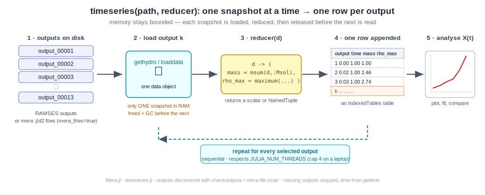
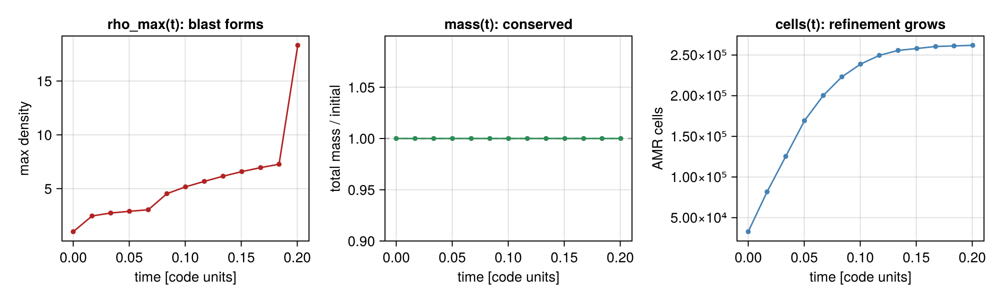
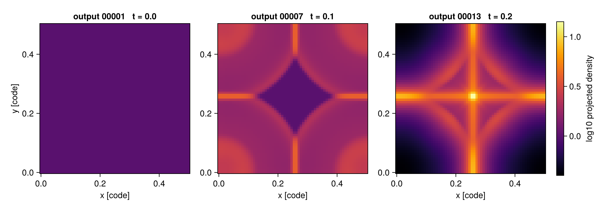

# Time Series (multi-snapshot analysis)

!!! tip "Run it yourself"
    This page is also an executable **Jupyter notebook** — [open / download `timeseries.ipynb`](https://github.com/ManuelBehrendt/Notebooks/blob/master/Mera-Docs/version_1/timeseries.ipynb). The notebooks run end-to-end and double as part of Mera's test suite.

Most post-processing is not about one snapshot — it is about *evolution*: how a mass, a
peak density, a star-formation rate, or a profile changes across the outputs of a run.
Writing that loop by hand (find the outputs, load each one, handle a missing snapshot,
collect the numbers, keep memory under control) is boilerplate everyone re-implements.

[`timeseries`](@ref) turns it into a single call: you give it a **reducer** — a function
that maps one loaded snapshot to a scalar or a `NamedTuple` — and it returns one tidy
table with a row per output.



It works identically on **raw RAMSES outputs** and on **mera (`.jld2`) files**, and it loads
**one snapshot at a time** — each is reduced and released before the next is read — so peak
memory stays bounded on a laptop.

!!! note "3-D data"
    Mera reads 3-D RAMSES data; the examples below use a small 3-D Sedov blast.

## The idea, step by step

1. **Discover** the outputs in `path` (via [`checkoutputs`](@ref) for RAMSES, or a scan of
   `output_*.jld2` for mera files). Select all of them, a range, or an explicit list.
2. **Load** output *k* — [`gethydro`](@ref) for RAMSES, [`loaddata`](@ref) for mera files.
   Only this one snapshot is in memory.
3. **Reduce** it: your `reducer(d)` returns the quantities you care about.
4. **Append** a row `(output, time, …your fields…)` to the result table; free the snapshot.
5. **Analyse** the resulting table — plot, fit, compare.

## A real example: a 3-D Sedov blast

The fixture is a small Sedov point explosion (`levelmin=5`, `levelmax=6`, 13 outputs). One
call gives the total mass, the peak density, and the AMR cell count at every output:

```julia
using Mera

ts = timeseries("/data/Mera-Tests/timeseries_sedov3d", d -> (
        mass    = msum(d, :Msol),
        rho_max = maximum(getvar(d, :rho)),
        ncells  = length(d.data),
     ); time_unit = :standard)        # this Sedov fixture is dimensionless → code-unit time
```

The result is an `IndexedTables` table — one row per output, with `output` and `time`
columns added automatically (see [Physical time](#Physical-time-and-cosmological-runs) — the
default `time` is in **Myr**; the dimensionless Sedov sim is shown here in code units):

```text
Table with 13 rows, 5 columns:
output  time       mass         rho_max  ncells
───────────────────────────────────────────────
1       0.0        6.28e-35     1.00     32768
2       0.0168     6.28e-35     2.46     81789
3       0.0335     6.28e-35     2.74     125371
⋮
12      0.1837     6.28e-35     7.27     261234
13      0.2004     6.28e-35     18.32    261969
```

Plotting those columns against `time` tells the whole story of the run at a glance:



- **`rho_max(t)`** climbs as the shock steepens — the blast forms.
- **`mass(t)`** is flat: mass is conserved to round-off (the panel shows mass relative to
  its initial value, pinned at 1.0).
- **`ncells(t)`** grows from 32 768 to ~262 000 as the AMR mesh refines onto the expanding
  shock — a free diagnostic of how the grid is working.

Each column is a plain vector you can pull out with `IndexedTables.columns`:

```julia
using Mera.IndexedTables: columns
t   = columns(ts).time
rho = columns(ts).rho_max
```

## Watching the blast evolve: projections over time

The reducer can return *anything*, so it can return a [`projection`](@ref). This makes a
projection a natural per-snapshot reduction: the small 2-D map is kept while the heavy AMR
data of that snapshot is freed before the next is read. Reducing each output to its
column-density map gives a **time-series of maps** — the frames of a movie:

```julia
movie = timeseries("/data/Mera-Tests/timeseries_sedov3d",
                   d -> projection(d, :sd, verbose=false).maps[:sd];
                   outputs = [1, 7, 13])

frames = columns(movie).value     # a vector of 2-D maps, one per output
```

Laid side by side, the maps show the shell sweeping outward through the box:



Return a scalar instead when you only need a number per snapshot — for example the peak
column density over time, `d -> maximum(projection(d, :sd, verbose=false).maps[:sd])`.

## Physical time and cosmological runs

The `time` column is **physical** by default — Myr (from [`gettime`](@ref)), not code units —
so a time-series plots against a meaningful axis straight away. Choose another unit with
`time_unit` (`:Gyr`, `:yr`, …), or `time_unit = :standard` for code units (as the
dimensionless Sedov fixture above).

A **cosmological** run is detected automatically ([`iscosmological`](@ref)) and gets two extra
columns — `redshift` (`z = 1/aexp − 1`) and `aexp` — so you can plot any quantity against
redshift directly. The `time` column then holds the **age of the universe** in Myr:

```julia
ts = timeseries("/data/cosmo_run", d -> (sfr = …, mgas = msum(d, :Msol)))
# columns: output | time [Myr, = age] | redshift | aexp | sfr | mgas
using Mera.IndexedTables: columns
lines(columns(ts).redshift, columns(ts).mgas)     # gas mass vs redshift
```

## Selecting which outputs

```julia
timeseries(path, reducer)                       # all outputs
timeseries(path, reducer; outputs = 1:5)        # a range
timeseries(path, reducer; outputs = [1,7,13])   # an explicit list
```

Numbers that are not present on disk are silently skipped, so a half-finished run or a
gap in the output sequence is handled without special-casing.

## Keeping memory bounded

`timeseries` already loads one snapshot at a time and frees it before the next. Two more
levers cut the memory of *each* load — the main thing to reach for on a RAM-limited
machine or with large outputs:

```julia
# read only up to AMR level 5, and only a sub-box around the centre
timeseries(path, d -> length(d.data);
           lmax = 5,
           xrange = [0.4, 0.6], yrange = [0.4, 0.6], zrange = [0.4, 0.6])
```

Snapshots are processed **sequentially**, so the loop never multiplies memory across
outputs; the loaders themselves respect `JULIA_NUM_THREADS` (cap it at 4 on a laptop).

## From mera files

If you have converted a run to mera files with [`savedata`](@ref), point `timeseries` at
the folder of `output_*.jld2` files and set `mera_files=true`. The reducer and the
resulting table are identical — mera files are typically several times smaller and faster
to read:

```julia
timeseries("/data/Mera-Tests/timeseries_sedov3d_mera",
           d -> (mass = msum(d, :Msol), rho_max = maximum(getvar(d, :rho)));
           mera_files = true)
```

## Masking and other Mera functions

The reducer receives the **full data object** for the snapshot, so anything that operates
on a Mera data object composes inside it — there is nothing extra to wire up. That includes
[`getvar`](@ref), reductions like [`msum`](@ref) / [`center_of_mass`](@ref) /
[`bulk_velocity`](@ref), spatial selections like [`subregion`](@ref) / [`shellregion`](@ref),
[`projection`](@ref) (see above), and **masking** via the `mask=` keyword that most
reductions accept.

For example, the mass of the *dense* gas (and its fraction) at every output — a boolean
mask built from the snapshot and fed straight to `msum`:

```julia
ts = timeseries(path, d -> begin
        mask = getvar(d, :rho) .> 3.0                 # boolean mask over cells
        (m_total = msum(d, :Msol),
         m_dense = msum(d, :Msol, mask = mask),
         f_dense = msum(d, :Msol, mask = mask) / msum(d, :Msol))
     end)
# f_dense climbs 0.00 → 0.36 as the Sedov shock sweeps up and compresses gas
```

The same pattern covers "mass inside a sphere over time" (`subregion(d, :sphere, …)` then
`msum`), "centre-of-mass drift" ([`center_of_mass`](@ref)), kinematics
([`bulk_velocity`](@ref)), and so on — each is just a one-line reducer.

## Other data types — gravity, particles, clumps, RT

Set `datatype` to pick the loader. Radiative-transfer data (`:rt`) is a first-class type;
mera files round-trip RT too (`savedata`/`loaddata` support it), so the mera path works
the same way. On the Strömgren-sphere test run, the total photon density grows as the
source ionizes its surroundings:

```julia
ts = timeseries("/data/Mera-Tests/rt_stromgren",
                d -> (np1 = sum(getvar(d, :Np1)),);   # group-1 photon density
                datatype = :rt)
```

For particles or clumps, use `datatype=:particles` / `:clumps` and reduce the relevant
fields (e.g. `d -> length(d.data)` for a clump count, or a particle-mass sum).

## A custom loader

For full control over how each snapshot is read — specific variables, a different data
type, special keywords — pass a `loader` (`info -> data`). It overrides the built-in
loading:

```julia
timeseries(path, d -> maximum(getvar(d, :rho));
           loader = info -> gethydro(info, [:rho]; lmax = 6))
```

## Options

| keyword | default | meaning |
|---------|---------|---------|
| `datatype` | `:hydro` | `:hydro`, `:gravity`, `:particles`, `:clumps`, or `:rt` |
| `outputs` | `:all` | `:all`, a range, or a vector of output numbers |
| `mera_files` | `false` | read `output_*.jld2` mera files instead of RAMSES outputs |
| `loader` | `nothing` | custom `info -> data` (overrides `datatype`/ranges/`lmax`) |
| `lmax` | `info.levelmax` | max AMR level to read (hydro/gravity) |
| `xrange`,`yrange`,`zrange`,`center`,`range_unit` | full box | spatial selection → less RAM |
| `time_unit` | `:Myr` | unit of the `time` column — physical by default; `:standard` for code units (see [`gettime`](@ref)). Cosmological runs also get `redshift`/`aexp` columns |
| `verbose` | `true` | per-snapshot progress |
| `notify` | `false` | call [`notifyme`](@ref) when finished |

## See also

- [`checkoutputs`](@ref) — list the outputs available in a run.
- [`gethydro`](@ref), [`loaddata`](@ref) — the per-snapshot loaders.
- [`savedata`](@ref) — convert RAMSES outputs to mera files.
- [`gettime`](@ref) — the value in the `time` column.
