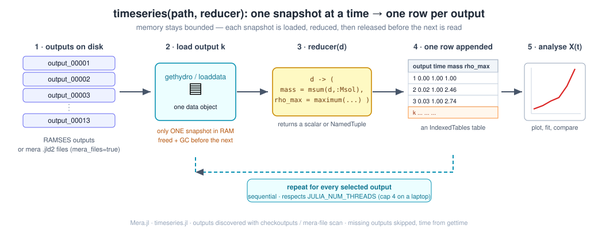
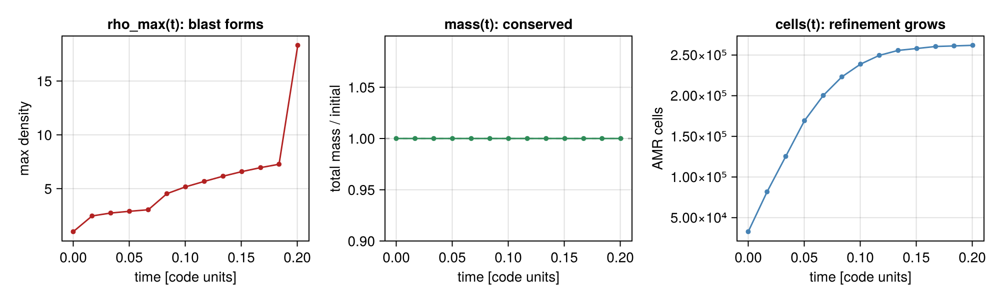
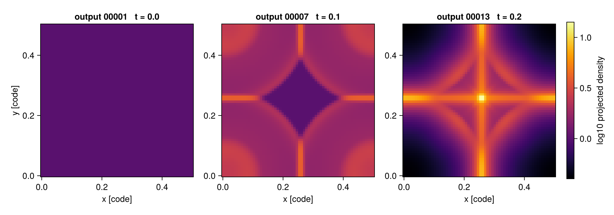
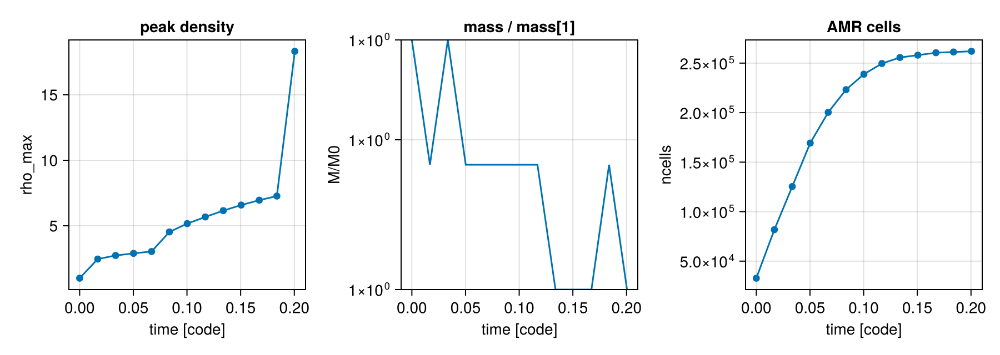

# Time Series (multi-snapshot analysis)

!!! tip "Run it yourself"
    This page is also an executable **Jupyter notebook** — [open / download `timeseries.ipynb`](https://github.com/ManuelBehrendt/Notebooks/blob/master/Mera-Docs/version_1.1/timeseries.ipynb). The notebooks run end-to-end and double as part of Mera's test suite.

Most post-processing is not about one snapshot — it is about *evolution*: how a mass, a
peak density, a star-formation rate, or a profile changes across the outputs of a run.
Writing that loop by hand (find the outputs, load each one, handle a missing snapshot,
collect the numbers, keep memory under control) is boilerplate everyone re-implements.

[`timeseries`](@ref) turns it into a single call: you give it a **reducer** — a function
that maps one loaded snapshot to a scalar or a `NamedTuple` — and it returns one tidy
table with a row per output.



It works identically on **raw RAMSES outputs** and on **mera (`.jld2`) files**, and it loads
**one snapshot at a time** — each is reduced and released before the next is read — so peak
memory stays bounded on a laptop.

!!! note "3-D data"
```
Mera reads 3-D RAMSES data; the examples below use a small 3-D Sedov blast.
```


## The idea, step by step

1. **Discover** the outputs in `path` (via [`checkoutputs`](@ref) for RAMSES, or a scan of
   `output_*.jld2` for mera files). Select all of them, a range, or an explicit list.
2. **Load** output *k* — [`gethydro`](@ref) for RAMSES, [`loaddata`](@ref) for mera files.
   Only this one snapshot is in memory.
3. **Reduce** it: your `reducer(d)` returns the quantities you care about.
4. **Append** a row `(output, time, …your fields…)` to the result table; free the snapshot.
5. **Analyse** the resulting table — plot, fit, compare.

```julia
using Mera
base = get(ENV, "MERA_TEST_DATA", "/Volumes/FASTStorage/Simulations/Mera-Tests")
run  = joinpath(base, "RAMSES/timeseries_sedov3d")

# discover the outputs available in the run
co = checkoutputs(run)
println("outputs found : ", co.outputs)
```


```
*__   __ _______ ______   _______ 
```


```
|  |_|  |       |    _ | |   _   |
|       |    ___|   | || |  |_|  |
|       |   |___|   |_||_|       |
|       |    ___|    __  |       |
| ||_|| |   |___|   |  | |   _   |
|_|   |_|_______|___|  |_|__| |__|
Mera v1.8.0
```


```
Outputs - existing: 13 betw. 1:13 - missing: 0
```


```
outputs found : 
```


```
[1, 2, 3, 4, 5, 6, 7, 8, 9, 10, 11, 12, 13]
```


## A real example: a 3-D Sedov blast

The fixture is a small Sedov point explosion (`levelmin=5`, `levelmax=6`, 13 outputs). One
call gives the total mass, the peak density, and the AMR cell count at every output:

```julia
ts = timeseries(run, d -> (
        mass    = msum(d, :Msol),
        rho_max = maximum(getvar(d, :rho)),
        ncells  = length(d.data),
     ); time_unit = :standard)

println(ts)
```

```
timeseries: 13 snapshot(s) from "/Volumes/FASTStorage/Simulations/Mera-Tests/RAMSES/timeseries_sedov3d" (ramses outputs, :hydro)
```


```
  [1/13] output 00001  t=0.0
```


```
  [2/13] output 00002  t=0.0168274109063273
```


```
  [3/13] output 00003  t=0.0334922695630072
```


```
  [4/13] output 00004  t=0.0502054026812579
```


```
  [5/13] output 00005  t=0.067001415409705
```


```
  [6/13] output 00006  t=0.0835998926373125
```


```
  [7/13] output 00007  t=0.100237444220885
```


```
  [8/13] output 00008  t=0.117016237218468
```


```
  [9/13] output 00009  t=0.133806270459172
```


```
  [10/13] output 00010  t=0.150500035380911
```


```
  [11/13] output 00011  t=0.167316266875268
```


```
  [12/13] output 00012  t=0.183733818129636
```


```
  [13/13] output 00013  t=0.20044896107714
```


```
Table with 13 rows, 5 columns:
```


```
output  time       mass         rho_max  ncells
───────────────────────────────────────────────
1       0.0        6.28425e-35  1.0      32768
2       0.0168274  6.28425e-35  2.46208  81789
3       0.0334923  6.28425e-35  2.73502  125371
4       0.0502054  6.28425e-35  2.89539  169254
5       0.0670014  6.28425e-35  3.03729  200306
6       0.0835999  6.28425e-35  4.53239  223203
7       0.100237   6.28425e-35  5.16768  238827
8       0.117016   6.28425e-35  5.67461  249635
9       0.133806   6.28425e-35  6.15751  255718
10      0.1505     6.28425e-35  6.58408  258070
11      0.167316   6.28425e-35  6.95533  260520
12      0.183734   6.28425e-35  7.26834  261234
13      0.200449   6.28425e-35  18.3208  261969
```


The result is an `IndexedTables` table — one row per output, with `output` and `time`
columns added automatically (see [Physical time](#Physical-time-and-cosmological-runs) — the
default `time` is in **Myr**; the dimensionless Sedov sim is shown here in code units).

Plotting those columns against `time` tells the whole story of the run at a glance:



- **`rho_max(t)`** climbs as the shock steepens — the blast forms.
- **`mass(t)`** is flat: mass is conserved to round-off (the panel shows mass relative to
  its initial value, pinned at 1.0).
- **`ncells(t)`** grows from 32 768 to ~262 000 as the AMR mesh refines onto the expanding
  shock — a free diagnostic of how the grid is working.

Each column is a plain vector you can pull out with `IndexedTables.columns`:

```julia
using Mera.IndexedTables: columns

t   = columns(ts).time
rho = columns(ts).rho_max
m   = columns(ts).mass
nc  = columns(ts).ncells

@show t
@show rho
@show extrema(m)            # mass is conserved → flat
@show nc[1], nc[end]        # AMR cell count grows as the shock refines
```

```
t = [0.0, 0.0168274109063273, 0.0334922695630072, 0.0502054026812579, 0.067001415409705, 0.0835998926373125, 0.100237444220885, 0.117016237218468, 0.133806270459172, 0.150500035380911, 0.167316266875268, 0.183733818129636, 0.20044896107714]
```


```
rho = [1.0, 2.4620841187532374, 2.7350213089012847, 2.8953918239760763, 3.037285921194034, 4.532394520680104, 5.1676847422567995, 5.674611306033254, 6.15750882977664, 6.584083574556392, 6.955331402702706, 7.268339045626411, 18.320822161297333]
extrema(m) = (6.284249157910609e-35, 6.284249157910612e-35)
```


```
(nc[1], nc[end]) = (32768, 261969)
```


```
(32768, 261969)
```


## Masking and other Mera functions

The reducer receives the **full data object** for the snapshot, so anything that operates
on a Mera data object composes inside it — there is nothing extra to wire up. That includes
[`getvar`](@ref), reductions like [`msum`](@ref) / [`center_of_mass`](@ref) /
[`bulk_velocity`](@ref), spatial selections like [`subregion`](@ref) / [`shellregion`](@ref),
[`projection`](@ref) (see below), and **masking** via the `mask=` keyword that most
reductions accept.

For example, the mass of the *dense* gas (and its fraction) at every output — a boolean
mask built from the snapshot and fed straight to `msum`:

```julia
tsm = timeseries(run, d -> begin
        mask = getvar(d, :rho) .> 3.0
        (m_total = msum(d, :Msol),
         m_dense = msum(d, :Msol, mask = mask),
         f_dense = msum(d, :Msol, mask = mask) / msum(d, :Msol))
     end; time_unit = :standard)

@show columns(tsm).f_dense        # climbs as the shock sweeps up gas
```

```
timeseries: 13 snapshot(s) from "/Volumes/FASTStorage/Simulations/Mera-Tests/RAMSES/timeseries_sedov3d" (ramses outputs, :hydro)
```


```
  [1/13] output 00001  t=0.0
```


```
  [2/13] output 00002  t=0.0168274109063273
  [3/13] output 00003  t=0.0334922695630072
```


```
  [4/13] output 00004  t=0.0502054026812579
```


```
  [5/13] output 00005  t=0.067001415409705
```


```
  [6/13] output 00006  t=0.0835998926373125
```


```
  [7/13] output 00007  t=0.100237444220885
```


```
  [8/13] output 00008  t=0.117016237218468
```


```
  [9/13] output 00009  t=0.133806270459172
```


```
  [10/13] output 00010  t=0.150500035380911
```


```
  [11/13] output 00011  t=0.167316266875268
```


```
  [12/13] output 00012  t=0.183733818129636
```


```
  [13/13] output 00013  t=0.20044896107714
```


```
(columns(tsm)).f_dense = [0.0, 0.0, 0.0, 0.0, 0.0024885796552046873, 0.04568311531952604, 0.140885107600832, 0.27492312592427803, 0.32419613075023884, 0.33554232939318124, 0.34071834186383704, 0.3411209721585522, 0.36393986186171234]
```


```
13-element Vector{Float64}:
 0.0
 0.0
 0.0
 0.0
 0.0024885796552046873
 0.04568311531952604
 0.140885107600832
 0.27492312592427803
 0.32419613075023884
 0.33554232939318124
 0.34071834186383704
 0.3411209721585522
 0.36393986186171234
```


The same pattern covers "mass inside a sphere over time" (`subregion(d, :sphere, …)` then
`msum`), "centre-of-mass drift" ([`center_of_mass`](@ref)), kinematics
([`bulk_velocity`](@ref)), and so on — each is just a one-line reducer.

## Watching the blast evolve: projections over time

The reducer can return *anything*, so it can return a [`projection`](@ref). This makes a
projection a natural per-snapshot reduction: the small 2-D map is kept while the heavy AMR
data of that snapshot is freed before the next is read. Reducing each output to its
column-density map gives a **time-series of maps** — the frames of a movie:

```julia
movie = timeseries(run,
                   d -> projection(d, :sd, verbose=false).maps[:sd];
                   outputs = [1, 7, 13], time_unit = :standard)

frames = columns(movie).value      # a vector of 2-D maps, one per output
println("number of frames : ", length(frames))
println("frame size       : ", size(frames[1]))
println("peak Sigma/frame : ", round.(maximum.(frames), sigdigits=4))
```

```
timeseries: 3 snapshot(s) from "/Volumes/FASTStorage/Simulations/Mera-Tests/RAMSES/timeseries_sedov3d" (ramses outputs, :hydro)
```


```
  [1/3] output 00001  t=0.0
```


```
  [2/3] output 00007  t=0.100237444220885
```


```
  [3/3] output 00013  t=0.20044896107714
```


```
number of frames : 3
```


```
frame size       : (64, 64)
peak Sigma/frame : 
```


```
[0.5, 1.413, 3.343]
```


Laid side by side, the maps show the shell sweeping outward through the box:



Return a scalar instead when you only need a number per snapshot — for example the peak
column density over time, `d -> maximum(projection(d, :sd, verbose=false).maps[:sd])`.

## Physical time and cosmological runs

The `time` column is **physical** by default — Myr (from [`gettime`](@ref)), not code units —
so a time-series plots against a meaningful axis straight away. Choose another unit with
`time_unit` (`:Gyr`, `:yr`, …), or `time_unit = :standard` for code units (as the
dimensionless Sedov fixture above).

A **cosmological** run is detected automatically ([`iscosmological`](@ref)) and gets two extra
columns — `redshift` (`z = 1/aexp − 1`) and `aexp` — so you can plot any quantity against
redshift directly. The `time` column then holds the **age of the universe** in Myr.

## Selecting which outputs

`outputs` takes `:all` (the default), a range (`1:5`), or an explicit list (`[1, 7, 13]`).
Numbers that are not present on disk are silently skipped, so a half-finished run or a
gap in the output sequence is handled without special-casing.

## Keeping memory bounded

`timeseries` already loads one snapshot at a time and frees it before the next. Two more
levers cut the memory of *each* load — the main thing to reach for on a RAM-limited
machine or with large outputs:

```julia
tssel = timeseries(run, d -> length(d.data);
                   outputs = 1:5,
                   lmax = 5,
                   xrange = [0.4, 0.6], yrange = [0.4, 0.6], zrange = [0.4, 0.6],
                   time_unit = :standard, verbose = false)

println(tssel)
```

```
Table with 5 rows, 3 columns:
```


```
output  time       value
────────────────────────
1       0.0        512
2       0.0168274  512
3       0.0334923  512
4       0.0502054  512
5       0.0670014  512
```


Snapshots are processed **sequentially**, so the loop never multiplies memory across
outputs; the loaders themselves respect `JULIA_NUM_THREADS` (cap it at 4 on a laptop).

## Visualise the evolution

Peak density rises as the blast forms; total mass is conserved (shown relative to its
initial value); the AMR cell count grows as refinement tracks the shock.

```julia
using CairoMakie

fig = Figure(size = (900, 320))
ax1 = Axis(fig[1,1]; title = "peak density",  xlabel = "time [code]", ylabel = "rho_max")
ax2 = Axis(fig[1,2]; title = "mass / mass[1]", xlabel = "time [code]", ylabel = "M/M0")
ax3 = Axis(fig[1,3]; title = "AMR cells",      xlabel = "time [code]", ylabel = "ncells")
lines!(ax1, t, rho); scatter!(ax1, t, rho)
lines!(ax2, t, m ./ m[1])
lines!(ax3, t, Float64.(nc)); scatter!(ax3, t, Float64.(nc))
fig
```





## From mera files

If you have converted a run to mera files with [`savedata`](@ref), point `timeseries` at
the folder of `output_*.jld2` files and set `mera_files=true`. The reducer and the
resulting table are identical — mera files are typically several times smaller and faster
to read.

## Other data types — gravity, particles, clumps, RT

Set `datatype` to pick the loader. Radiative-transfer data (`:rt`) is a first-class type;
mera files round-trip RT too (`savedata`/`loaddata` support it), so the mera path works
the same way. On the Strömgren-sphere test run, the total photon density grows as the
source ionizes its surroundings.

For particles or clumps, use `datatype=:particles` / `:clumps` and reduce the relevant
fields (e.g. `d -> length(d.data)` for a clump count, or a particle-mass sum).

## A custom loader

For full control over how each snapshot is read — specific variables, a different data
type, special keywords — pass a `loader` (`info -> data`). It overrides the built-in
loading — e.g. `loader = info -> gethydro(info, [:rho]; lmax = 6)`.

## Options

| keyword | default | meaning |
|---------|---------|---------|
| `datatype` | `:hydro` | `:hydro`, `:gravity`, `:particles`, `:clumps`, or `:rt` |
| `outputs` | `:all` | `:all`, a range, or a vector of output numbers |
| `mera_files` | `false` | read `output_*.jld2` mera files instead of RAMSES outputs |
| `loader` | `nothing` | custom `info -> data` (overrides `datatype`/ranges/`lmax`) |
| `lmax` | `info.levelmax` | max AMR level to read (hydro/gravity) |
| `xrange`,`yrange`,`zrange`,`center`,`range_unit` | full box | spatial selection → less RAM |
| `time_unit` | `:Myr` | unit of the `time` column — physical by default; `:standard` for code units (see [`gettime`](@ref)). Cosmological runs also get `redshift`/`aexp` columns |
| `verbose` | `true` | per-snapshot progress |
| `notify` | `false` | call [`notifyme`](@ref) when finished |

## See also

- [`checkoutputs`](@ref) — list the outputs available in a run.
- [`gethydro`](@ref), [`loaddata`](@ref) — the per-snapshot loaders.
- [`savedata`](@ref) — convert RAMSES outputs to mera files.
- [`gettime`](@ref) — the value in the `time` column.
